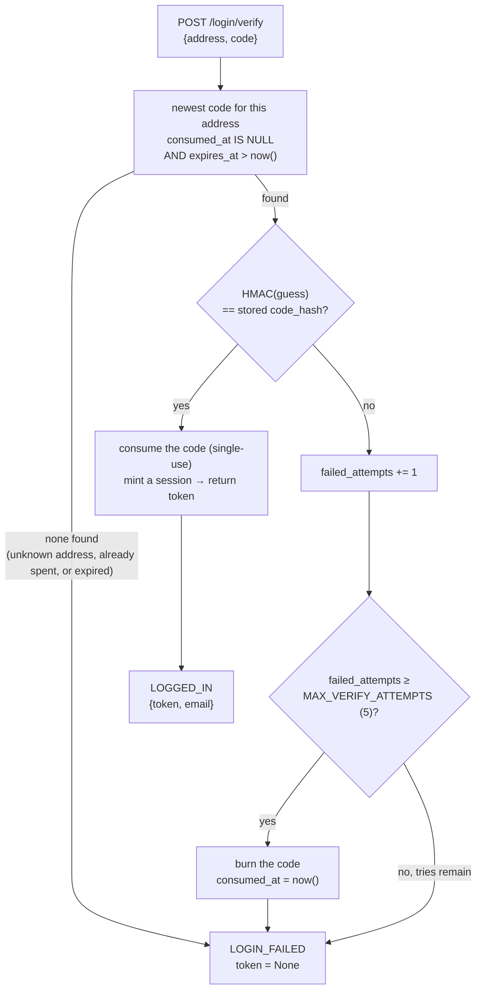

# authentication: a one-time code, spent for a session

The kernel has no passwords. A symbiot proves who they are by receiving a short code at an address the kernel already knows, and spending that code — once — for a session token the shell then carries. That's the whole scheme: **a one-time code emailed to a registered symbiot, spent for a session.** It lives in [`services/identity.py`](../services/identity.py), sits behind the [`/login`, `/login/verify`, `/status`, `/logout`](../main.py) routes, and rests on two invariants that this document is really about — *nothing here is an oracle*, and *every abuse limit is enforced by the database row, not by request timing*.

## the handshake

```mermaid
sequenceDiagram
    participant S as shell
    participant K as kernel — main.py
    participant DB as Postgres
    participant M as email

    S->>K: POST /login {address}
    K->>DB: exact-match a registered symbiot?
    Note over K,DB: no match → no code, no mail — reply is identical either way
    K->>DB: on a match, overwrite the symbiot's single live code
    K->>M: email the 8-digit code (only on a match)
    K-->>S: LOGIN_SENT — "if that address is registered, a code is on its way"

    S->>K: POST /login/verify {address, code}
    K->>DB: newest live code for the address → HMAC-compare
    alt correct, unspent, unexpired
        K->>DB: mark it consumed (single-use); mint a session
        K-->>S: LOGGED_IN {token, email}
    else wrong / spent / expired / unknown address
        K->>DB: charge one failed attempt; burn the code if the budget is now spent
        K-->>S: LOGIN_FAILED — the same reply for every kind of failure
    end

    S->>K: later requests carry Authorization: Bearer <token>
    K->>DB: token hash → a live session → the symbiot's id
    K-->>S: served as that symbiot (absent/expired token = anonymous, never an error)
```

## issuing a code, without telling anyone whether it happened

[`issue_login_code`](../services/identity.py) normalises the address and looks for an **exact** match against a registered symbiot. If there's no match — an unknown address, a blank one, a recipient-smuggling string — it returns quietly: no code is written and no mail is sent. Crucially, the [`/login`](../main.py) route returns the very same `LOGIN_SENT` line whether a code went out or not. So an attacker poking at the endpoint learns nothing about who is registered; the reply is not an oracle for address enumeration.

On a match, the symbiot's single live code is overwritten in place. Two guarantees ride on the row layer rather than on the order the SQL happens to run:

- **One spendable code per symbiot.** A partial unique index (`login_code_one_live_per_symbiot`, in [`0001_identity.sql`](../migrations/0001_identity.sql)) makes a second live code physically impossible, so two overlapping `/login` taps can't interleave into two valid codes — the upsert rewrites the one live row instead. Only the newest code can ever be spent.
- **At most one fresh code per re-issue interval.** The upsert's `DO UPDATE` fires only when the existing code is already older than [`config.LOGIN_REISSUE_INTERVAL_SECONDS`](../core/config.py) (default **60s**). So a burst of `/login` taps can't become a burst of mail, and a double-tap never invalidates the code already sitting in the inbox. The database decides whether a code was issued, and the kernel emails only when it says one was.

The code itself is **eight digits** ([`_CODE_DIGITS`](../services/identity.py)) — still typeable in one glance, but a hundredfold more guessing space than six — and it lives for [`config.LOGIN_CODE_TTL_SECONDS`](../core/config.py), **10 minutes**.

## spending a code — and the attempt budget

This is the retry logic worth being precise about. [`verify_login_code`](../services/identity.py) looks up the newest code for the address that is still unconsumed and unexpired, then HMAC-compares the guess against the stored hash. A correct guess consumes the code (single-use) and mints a session. A wrong guess is **charged against the code**: its `failed_attempts` counter climbs, and once it reaches [`config.MAX_VERIFY_ATTEMPTS`](../core/config.py) — default **5** — the same statement burns the code by stamping `consumed_at`. A burned code is simply never selected again, so from that point every guess, even the right one, fails identically.



Two properties make this a real bound rather than a hopeful one:

- **The burn is atomic with the guess.** It's one `UPDATE ... SET failed_attempts = failed_attempts + 1, consumed_at = CASE WHEN failed_attempts + 1 >= %s THEN now() ...`. Even if a script fires many verify requests at once, the count can't be raced past the limit — the row enforces the budget, not the sequence in which requests land. Brute force becomes a fixed budget per code, immune to which IP is doing the guessing.
- **Every failure returns the same thing.** Unknown address, no live code, wrong code, spent budget, expired code — all return `None`, which the route renders as the identical `LOGIN_FAILED`. Nothing distinguishes "wrong code" from "no such address," so verify is no more an oracle than login is.

If a symbiot burns through the budget, there is no unlock step and no lockout to wait out: they just request a fresh code with `/login`, which overwrites the dead one in place and resets `failed_attempts` to zero. The old code is gone; the new one starts its own budget.

## the session the code buys

A correct guess mints a session: a random `token_urlsafe(32)` returned to the shell **once**, with only its HMAC hash stored. The shell then threads it through every authed request as `Authorization: Bearer <token>` ([`bearer_token`](../main.py) parses the header). Two helpers read it:

- [`authenticated_symbiot_id`](../services/identity.py) resolves a token to the internal symbiot id for a scoped route, or `None` for an absent, revoked, or expired token — so a route is gated on a real session without re-checking the token's life itself.
- [`session_status`](../services/identity.py) answers the shell's "who am I" in human terms (the email), behind [`/status`](../main.py).

A session lives for [`config.SESSION_TTL_SECONDS`](../core/config.py), **24 hours** — long enough that the shell needn't re-login on every reload, short enough that a forgotten open tab doesn't stay authed forever. [`/logout`](../main.py) revokes it by stamping `revoked_at`, and is idempotent: no token, or an already-revoked one, is a clean no-op.

One design choice runs against the grain of most apps and is deliberate here: **auth names the symbiot, it does not gate the right to submit.** [`/intake`](../main.py) and [`/push/subscribe`](../main.py) accept input with or without a session — a live one stamps the message with its sender so the worker can answer by it later, its absence is simply an anonymous line, and both are welcome. The token proves identity; it is never a ticket to be heard.

## two brakes, and everything hashed

Guessing is bounded on two independent axes. The **attempt budget** above caps guesses against one specific code. Separately, the edge rate limiter in [`core/rate_limit.py`](../core/rate_limit.py) throttles the endpoints themselves — `/login` at 5 requests / 60s (an email cannon otherwise) and `/login/verify` at 10 / 60s — per client IP, before a request ever reaches a route. Together, an eight-digit code (a 10⁸ space) with a ~5-guess budget inside a 10-minute life, behind a per-IP request ceiling, makes brute force infeasible from both directions at once.

And underneath all of it, one rule: **anything secret is hashed before it touches the database.** [`_hash`](../services/identity.py) is HMAC-SHA256 with the server secret, applied to both the login code and the session token. A code is stored as `HMAC(code)`, a session as `HMAC(token)`; the plaintext of each is seen once and never written. So a leaked table yields neither a usable code nor a usable token — the values that matter simply aren't in it.

## the one line worth remembering

The security here doesn't live in the order the code runs — it lives in the shape of the rows. One spendable code per symbiot, a guess budget that burns the code, a re-issue interval that quiets the mail, single-use consumption, hashed-at-rest secrets: each is a constraint the database holds, so it survives concurrency, retries, and a flaky network rather than assuming them away.
