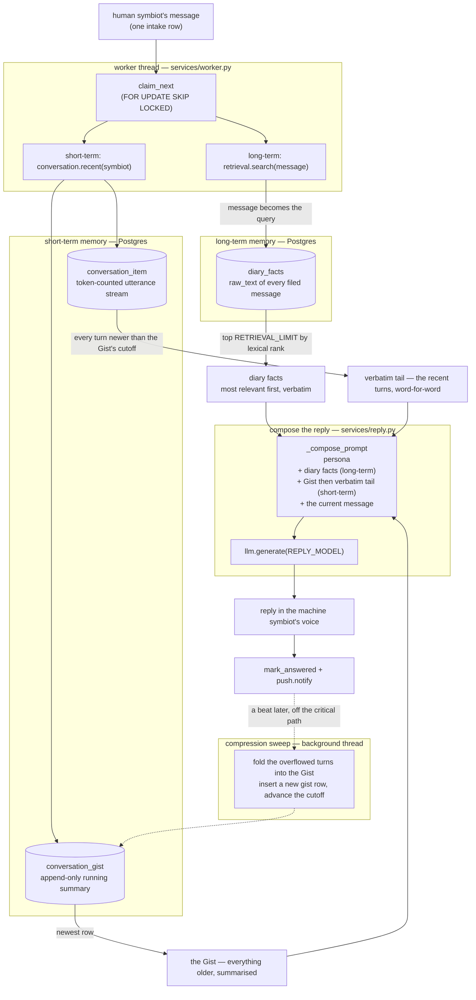
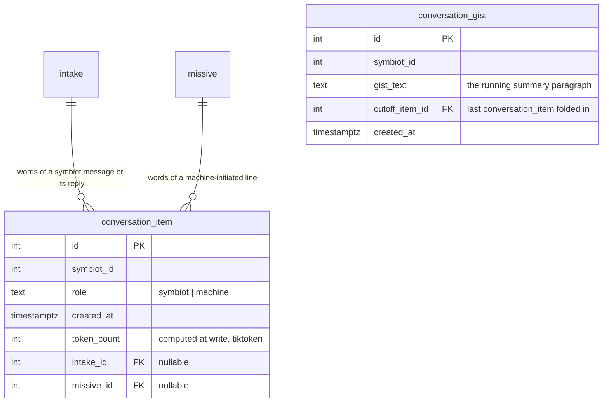
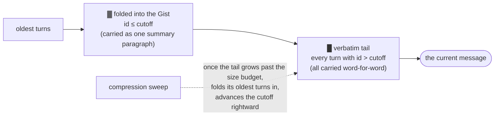

# the read path: what the quick reply knows before it speaks

When the human symbiot says something, the kernel answers fast — and the one thing worth being precise about is what that fast answer is allowed to know. It draws on four things: the machine symbiot's **persona** (its voice), the **single message just received**, its **long-term memory** — the diary, reached by lexical relevance to the message — and its **short-term memory** — the recent conversation it is sitting inside, the running back-and-forth this message is the next turn of.

Those last two are different kinds of memory, and keeping them apart is the whole point of this document.

- **Long-term memory — the diary.** Everything the symbiot has ever filed, fetched by how well its words bear on the current message, never by recency and never as a thread. A fact from months ago outranks yesterday's if it matches better. This is recall *by relevance*.
- **Short-term memory — the conversation.** The recent turns of the live exchange, both directions, held as a **gradient**: the newest turns carried word-for-word, the older ones compressed into a single running summary as they age out. This is memory *by recency* — the thread that lets "and the second one?" find what it points back to, which no relevance search over the diary could recover, because a pronoun carries none of the words that would surface the thing it stands for.

(A third kind of memory — the *origin reference* the deep second pass carries so a late enrichment can situate itself against what was said since — belongs to Tier 2 and is not part of this fast read path.)

One thing this design does **not** do, and it governs everything below: it *extends* the shipped read path, it does not replace any of it. The long-term diary reach ([`retrieval.search`](../services/retrieval.py)), the reply composition ([`reply.compose`](../services/reply.py)), live ingestion, and the budget backstop ([`llm._fit`](../services/llm.py)) are all built and proven — how the diary is searched, ranked, filed, and folded into the prompt does not change. Short-term memory is added *beside* long-term memory: a second kind of recall, answering "what were we just saying?" by recency where the diary answers "what do I know that bears on this?" by relevance. The one resource the two share is the prompt's token window; the sections below say how each is kept within its share — the diary by a post-hoc condense on overrun, the conversation by a background fold that trims its tail — rather than by a hard cap on either read.

## the shape of it



## long-term memory: the diary, reached by relevance

The gather step for the diary is [`retrieval.search`](../services/retrieval.py) — the fast lexical reach, Tier 1 of the read path. It takes the **message the symbiot just sent** and uses it as the search query against the `raw_text` of every fact in `diary_facts`. This is Postgres full-text search, not a vector reach: the message's words become a `tsquery`, loosened from AND to OR so a fact hits when it shares *any* of the words rather than all of them, run under both the English and French analysers, with trigram similarity (`pg_trgm`) alongside so a typo or half-remembered word still surfaces the fact it meant. Each hit is scored by a blended rank — the two analysers' `ts_rank`s plus trigram similarity — and the results come back **ordered by that rank, most relevant first**, with effective time breaking ties so the fresher of two equally-relevant facts leads.

The count is fixed by [`config.RETRIEVAL_LIMIT`](../core/config.py), default **10**: the ten filed facts whose words bear most on the question, drawn from anywhere in the diary's whole history. Recency is only a tie-breaker within equal rank. There is no notion here of "the last N messages" — the diary reach does not walk the conversation in order at all. That job belongs to short-term memory, below.

## short-term memory: the conversation, held as a gradient

The conversation is a memory gradient: near turns verbatim, far turns summarised, and nothing ever thrown away. It lives in two structures, and the reply reads both.

### the stream: every utterance, both directions, token-counted at write

Every utterance of the exchange — the symbiot's messages **and** the machine's replies **and** the machine's proactive missives — gets a row in `conversation_item` the moment it is written. The row does not copy the words: it carries a **pointer** to where they already live durably (the `intake` row for a symbiot message or its reply, the `missive` row for a machine-initiated line), plus the three things the read needs and the source table doesn't hold: the utterance's **role**, its **timestamp**, and its **token count**.

The token count is computed once, at write time, with `tiktoken` — the same local counter the budget guard uses ([`services/models.py`](../services/models.py)). Counting it at write and storing it is deliberate: it turns the read-time "how much fits?" question into pure arithmetic Postgres can do over an integer column, with no tokeniser call on the path the symbiot waits on. It is stored on `conversation_item` rather than on `intake` on purpose — `intake` is the diary of record and forbids storing anything derivable from the words beside them, and a token count is exactly that. Short-term memory is a projection built alongside the record, so caching a derived figure there is legitimate where on the record it would not be.



The pointer is two nullable foreign keys — `intake_id` and `missive_id` — under a `CHECK` that **exactly one** is set. This keeps real database-enforced referential integrity to *both* source tables (a pointer can never dangle at a row that isn't there) and encodes "every utterance comes from exactly one place" as a constraint the database holds, not a rule the writing code has to remember — the same schema-enforces-the-invariant discipline the rest of the kernel leans on. A symbiot's message and the reply to it are two rows both pointing at the same `intake` row, told apart by `role`; the text each resolves to is `intake.message` for the symbiot side and `intake.answer` for the machine side, and `missive`'s body for a machine-initiated line. Anonymous callers never get a `conversation_item` — the conversation is the symbiot's, the same boundary the diary keeps.

### Bucket 1, the present: the verbatim tail, the unbroken chain back to the cutoff

The recent turns are carried **word-for-word**, so the model's own attention resolves the pronouns and the parallel threads exactly as they were said — no linearising, no topic-clustering, just the raw interleaved feed in the order it happened. And the read carries **every** turn newer than the Gist's cutoff, however many tokens that is — it does not truncate. This is the design's state-consistency rule, and it is the whole point of this section: the Gist covers everything at or before the cutoff, the tail covers everything after it, so the two **touch exactly at the cutoff, with no gap and no overlap**, whatever the token count. A reply is never assembled from a fragmented memory — never a hole between what the summary holds and what the tail holds.

```sql
SELECT id, role, intake_id, missive_id, created_at
FROM conversation_item
WHERE symbiot_id = %(symbiot)s
  AND id > %(cutoff)s              -- everything newer than what the Gist already covers
ORDER BY id ASC;                   -- chronological, for the prompt
```

There is no running sum and no cap on this read: the size budget does not live here. It lives entirely in the **background fold** below, as its *trigger* — the threshold at which the sweep decides the tail has grown large enough to trim, by folding its oldest turns into the Gist and advancing the cutoff. So the budget still keeps the tail near a target size in steady state, but it does it by moving the cutoff forward (which this read then honours automatically), never by hiding turns from the read. That budget is a **reserved share** of the active model's optimal context window ([`services/models.py`](../services/models.py)) — the size it reads *well* — held as a per-model constant so it travels with the model if a fallback switches tiers; in practice all three generative tiers share one optimal window (131072), so the figure is stable across a fallback.

The consequence of an asynchronous fold is not a blind spot but a **temporarily fatter tail**: if the sweep lags, this read simply returns a few more verbatim turns than the budget nominally reserves, which the model still reads (its optimal window sits well above the reserved slice, and its advertised maximum above that again). And should a fold lag so far that the whole prompt would overrun the window, the post-hoc budget backstop [`llm._fit`](../services/llm.py) catches it — under a single rule that governs the whole prompt (see "how it is fed"): the persona, the instructions, and the live message are sacred and never shrunk, while everything the reply *remembers* — the diary facts and the conversation together — is one compressible block the guard may condense to fit. So an overrun degrades by squeezing what is remembered, never by dropping who is speaking or what was just said, and the reply always composes. Fatter, then; never blind, and never a hard failure.

### Bucket 2, the past: the Gist, append-only

Everything older than the verbatim tail is not dropped — it is folded into **the Gist**, a single running summary paragraph. The Gist lives in `conversation_gist`, and that table is **append-only**: each compression fold inserts a *new* row carrying the updated paragraph **and** the `cutoff_item_id` it reached — the id of the last `conversation_item` absorbed into it. The current Gist is simply the newest row for the symbiot; nothing is ever overwritten, so the table is also a durable, inspectable history of how the summary grew and where its boundary stood at every step. The cutoff is a hard foreign-key integer the code reads directly — never a value parsed back out of the summary prose, which would be a probabilistic guess at a fact the schema can state exactly.



The two bands meet at the cutoff and cover the whole stream between them — there is no third, un-covered band. When the sweep folds, the cutoff moves right: turns cross from the tail into the Gist, and the tail shortens back toward its budget. Until it does, those turns are still in the tail, read in full.

### the compression sweep: folding the past, off the critical path

The fold is done by a background sweep — a fourth loop beside the worker pool, the reconcile sweep, and the ingestion sweep, cut from the same cloth ([`worker.py`](../services/worker.py)). It never runs on the path the symbiot waits on, so the reply carries zero latency from it. Each pass:

1. finds a symbiot whose verbatim tail has grown past the size budget — the trigger — and reads its newest `conversation_gist` row for the current paragraph and its cutoff;
2. gathers the **oldest** of the turns newer than that cutoff — the overflow beyond the budget, the part that has made the tail fatter than its target — resolving their words through the pointer, and leaving the recent within-budget turns in the tail;
3. asks the **same heavy model that composes the replies** (`REPLY_MODEL`) to merge the existing Gist and those older turns into **one fresh paragraph aimed at a fixed token target**, keeping the concrete facts and dropping the redundancy — the fold runs off the critical path, but the Gist is what a later reply reads back through once a turn has aged out of the tail, so its quality is load-bearing and a cheap local model proved too unreliable for it in practice;
4. **inserts one new `conversation_gist` row** with the merged paragraph and the new cutoff (the id of the last turn it just absorbed) — which shortens the tail the next read sees, since the tail is always "everything past the cutoff".

Because the table is append-only, the whole fold is a single `INSERT` — no flag to flip on the folded rows, no row to overwrite. A crash before the commit leaves nothing inserted and the same turns still eligible next pass; a crash after has already advanced the cutoff, so those turns fall outside the next pass's "newer than cutoff" gather and are never folded twice. Exactly-once falls out of the cutoff advancing, the same way ingestion's exactly-once falls out of its uniqueness constraint — pinned by the data, not by the sweep being careful.

**Why the Gist stays bounded.** A fold re-compresses rather than accumulates: each pass regenerates the whole paragraph from `(current Gist + the overflowed turns)` down to a fixed budget, so the Gist is rewritten to the same size every pass and cannot creep upward over time. That budget is a reserved share of the active model's optimal window — a per-model constant, the same shape as Bucket 1's verbatim budget — and it, the persona, the diary facts, the verbatim tail, the current message, the instruction, and the output headroom all sum to under the window. The cap is a guarantee, not a request, exactly as [`llm._summarise`](../services/llm.py) already makes it for the diary facts: the merge prompt names the target, and the result is hard-truncated to it with [`models.truncate_tokens`](../services/models.py), so an overshooting model still cannot push the Gist past its size. What a fixed-size paragraph cannot do is hold every fact of an ever-longer history — old detail blurs as it is folded and re-folded — which is tolerable only because nothing is truly lost: the verbatim words stay in `intake`, and the diary can still surface the fact by relevance.

**There is no blind spot in doing this asynchronously.** A turn that has grown the tail past the budget but has not yet been folded is *still carried in full* — it is part of the verbatim tail until the sweep moves it into the Gist and advances the cutoff, and the tail and the Gist always meet exactly at that cutoff. What a lagging sweep costs is not memory but tokens: the tail is temporarily fatter than its target, so the reply carries a few more verbatim turns than the budget reserves. The model reads them (its optimal window sits well above the reserved slice); and in the extreme — a sweep so far behind that the tail alone approached the window — the budget backstop [`llm._fit`](../services/llm.py) condenses the tail as a last resort, the same graceful degradation it gives the diary facts, so the prompt shrinks rather than the reply failing. This is the deliberate trade the two-bucket design makes: a reply that is always fast and **always whole**, over one that blocks to summarise on the critical path — and a temporarily larger prompt, never a fragmented memory, as the price of doing the fold off to the side.

## how it is fed to the machine symbiot

The composing half is [`reply.compose`](../services/reply.py). It folds everything into one prompt through [`_compose_prompt`](../services/reply.py) in a fixed order: the **persona** first (who is speaking), then the framing instructions, then **one block of everything the reply remembers** — the diary facts, then the Gist, then the verbatim tail, the past before the present so the model reads the summarised backstory and then walks into the live exchange — then the **current message**, then the closing instruction that keeps the model answering as itself.

The diary facts are rendered as one dated line each — the fact's effective date, then its own words verbatim, most relevant first. The verbatim tail is rendered in chronological order, each turn tagged with its role, so the exchange reads top-to-bottom as it happened. When there is nothing on record and no conversation yet — a fresh symbiot, an empty store — the block renders a single honest line where each part would go rather than a blank, and the reply is drawn from the persona and the message alone.

The whole prompt is handed to [`llm.generate`](../services/llm.py) with [`config.REPLY_MODEL`](../core/config.py), under **one rule for what may be squeezed if the prompt would overrun the model's window** (the budget backstop, [`llm._fit`](../services/llm.py)): the **persona, the instructions, and the current message are sacred** — never condensed, because they are who is speaking, how to answer, and what was just said — and the **one remembered block (diary + Gist + verbatim tail) is the sole compressible region**. So an overrun is met by condensing what the reply remembers, never by dropping the sacred parts, and the reply always composes rather than failing for want of room. In the common case the prompt sits far under the window and nothing is condensed at all; in steady state the diary is small and the fold keeps the conversation near its slice, so the backstop is exactly that — a backstop, not a routine step.

## the memory gradient, in one line

The quick reply is no longer stateless: it carries the conversation as a gradient — **the recent turns verbatim, the older turns summarised, and nothing ever deleted.** Continuity now lives where a conversation actually keeps it — in the thread itself — rather than only in what the next message happens to lexically match in the diary. And "nothing deleted" is the literal truth at every level: the verbatim words stay in `intake` forever, the Gist keeps every fold it ever made, and even a detail blurred by summarisation is still recoverable, because the durable record and the long-term diary both still hold it. The Gist is the glue that keeps the exchange coherent turn to turn; it is never the only place a thing is kept.
