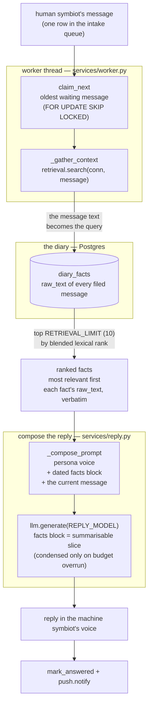

# the read path: what the quick reply knows before it speaks

When the human symbiot says something, the kernel answers fast — and the one thing worth being precise about is what that fast answer is allowed to know. It is **not** the last few messages of the conversation, neither their verbatim text nor a summary of them. The quick reply is composed from three things and only three: the machine symbiot's **persona**, the **single message just received**, and a handful of **diary facts pulled from the store by lexical relevance to that message** — never by recency, never as a running thread. This document traces that path end to end and names where each piece comes from.

## the shape of it



## what is retrieved, and how it is chosen

The gather step is [`retrieval.search`](../services/retrieval.py) — the fast lexical reach into the diary, Tier 1 of the read path. It takes the **message the symbiot just sent** and uses it as the search query against the `raw_text` of every fact in `diary_facts`. This is Postgres full-text search, not a vector reach: the message's words become a `tsquery`, loosened from AND to OR so a fact hits when it shares *any* of the words rather than all of them, run under both the English and French analysers, with trigram similarity (`pg_trgm`) alongside so a typo or half-remembered word still surfaces the fact it meant. Each hit is scored by a blended rank — the two analysers' `ts_rank`s plus trigram similarity — and the results come back **ordered by that rank, most relevant first**, with effective time breaking ties so the fresher of two equally-relevant facts leads.

The count is fixed by [`config.RETRIEVAL_LIMIT`](../core/config.py), default **10**. This is the crucial point about *what* is retrieved: these are the ten filed facts whose words bear most on the question, drawn from anywhere in the diary's whole history. Recency is only a tie-breaker within equal rank — a fact from months ago outranks yesterday's if it matches the question better. There is no notion here of "the last N messages": the read path does not walk the conversation in order at all.

An anonymous caller never reaches this step. [`_gather_context`](../services/worker.py) returns an empty list when there is no recognised symbiot, and [`_produce_reply`](../services/worker.py) hands a stranger the canned stand-in (`protocol.STANDIN_ANSWER_ANON`) instead — the diary is the symbiot's own memory, and it is never read to answer someone else.

## how it is fed to the machine symbiot

The composing half is [`reply.compose`](../services/reply.py). It folds the retrieved facts into one prompt through [`_compose_prompt`](../services/reply.py), in a fixed order: the persona voice first (who is speaking), then the diary block, then the message, then the one instruction that keeps the model answering as itself. The facts are rendered by [`_render`](../services/reply.py) as one dated line each — the fact's effective date, then its own words **verbatim** — most relevant first:

```python
return "\n".join(f"- [{f.effective_at.date().isoformat()}] {f.raw_text}" for f in facts)
```

So the words the model sees are the words as they were filed, not a paraphrase and not a précis. When the librarian found nothing — an empty diary, or a store not yet fed by ingestion — the block renders a single honest line, `(nothing on record that bears on this)`, and the reply is drawn from the persona and the message alone.

The whole thing is handed to [`llm.generate`](../services/llm.py) with [`config.REPLY_MODEL`](../core/config.py). One subtlety lives in that call and is the only place the word *summary* enters the read path: the facts block is passed as the prompt's **summarisable slice**. If — and only if — the assembled prompt ever overran the model's token budget, [`llm._fit`](../services/llm.py) would condense that slice rather than the persona or the instructions around it. In the common case the ten short facts are far too small to trigger it, so they pass through untouched. This is a budget-overflow guard on the retrieved facts, not a summary of any conversation.

## the one line worth remembering

The quick reply is **stateless with respect to conversation history**. It carries no memory of the previous turns — not verbatim, not summarised. Each time, it reconstructs the background it needs by searching the diary for the facts most relevant to the new message, and reads those in verbatim. Continuity across a conversation therefore lives entirely in what ingestion has filed into `diary_facts` and what the next message happens to match — not in any retained thread on the reply path.
