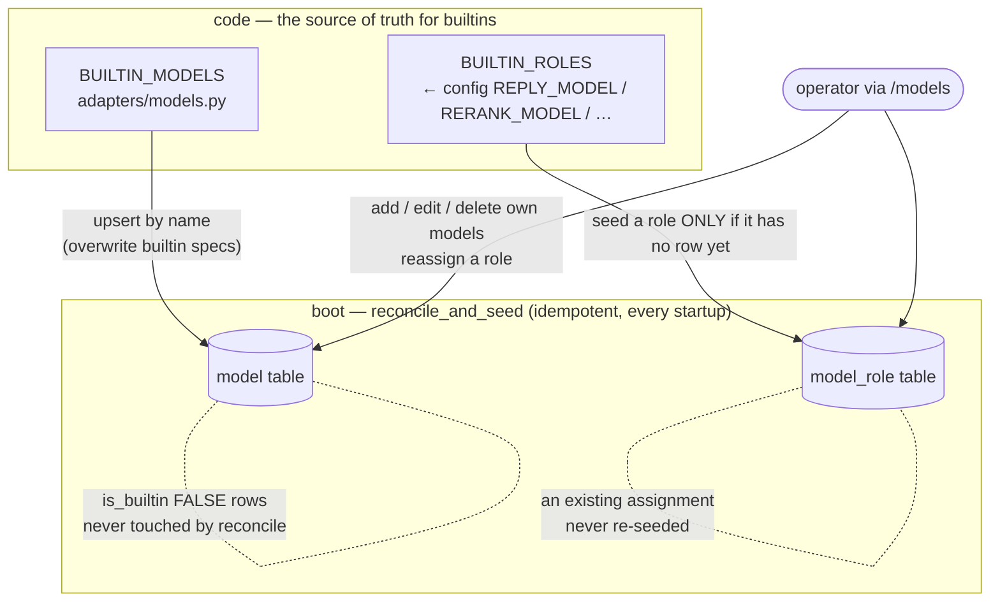
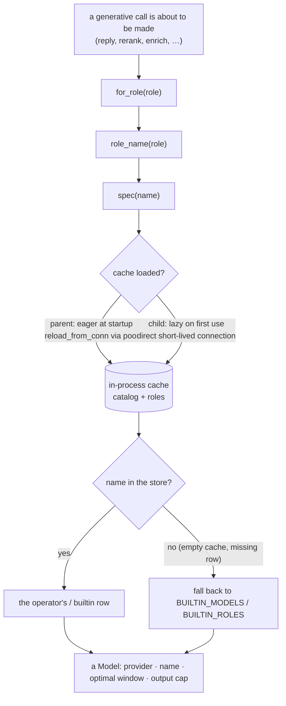

# the models: a durable catalog, not a hardcoded one

The kernel makes generative calls — the reply, the router's rerank, the enrichment gate, and a few more — and every one of them has to answer two questions first: *which model do I talk to for this job, and what are its characteristics?* The scheme behind those two questions is the subject of this document. Its one governing move: **the answer used to be baked into the code, and now it is durable, operator-editable state — seeded from code, overridable by the operator, and resolved live at call time.**

That matters because of who runs this box. A cloud deployment ships knowing the providers it was wired to. But The Joy is meant to run on a friend's home server too — a machine with no Scaleway key and no Mistral account, nothing but a local Ollama. On that box the shipped defaults are exactly wrong, and the operator needs to point every role at a local model without editing Python and redeploying. So the model config became state, the same way the timezone and the [notification switches](notifications.md) already are — but **global and box-level, not per-symbiot**: a model is a property of the machine and the Ollama it can reach, not of a person's perception of their own day.

The pieces live in three files. [`migrations/0019_model_config.sql`](../migrations/0019_model_config.sql) defines the two tables. [`services/memory/model_config.py`](../services/memory/model_config.py) owns every *write* to them — the boot seed and the `/models` command's edits. [`services/adapters/models.py`](../services/adapters/models.py) is the *read* side — the seed the store is reconciled from, the fallback everything falls back to, and the resolver-plus-cache that answers "which model, and what specs?" wherever a generative call is about to happen.

## two things, two tables

"The model config" is really two separate things, and the split is the first thing to hold onto.

The **catalog** is the set of models the kernel knows how to talk to — one row per model, each carrying the characteristics it *must* be driven by: who serves it (`provider`), the exact id it answers to (`name`), the window it reads *well* (`optimal_context_tokens`), and the ceiling on a single reply (`max_output_tokens`). This is the `model` table.

The **assignment** is which model, out of that catalog, plays each generative *role* — the reply, the rerank, the enrichment gate, and so on. This is the `model_role` table: one row per role, naming a catalog model by name.

The split lets a role point at a catalog entry by name, so assigning one model to two roles stores its specs once, in one place. `name` is the primary key of `model` and the target of the foreign key from `model_role`, with `ON DELETE RESTRICT` (a model a role still points at cannot be deleted out from under it) and `ON UPDATE CASCADE` (a rename carries its assignments along). The roles themselves are stable slugs — `reply`, `rerank`, `enrich`, `tool_decision`, `tool_confirm`, `conversation_compress` — each holding exactly one standing assignment.

## builtins from code, operator rows from the operator

Every row in `model` is one of two kinds, and the `is_builtin` flag is the whole distinction.

A **builtin** is a model the kernel ships knowing how to talk to. The source of truth for a builtin's verified specs is code — `BUILTIN_MODELS` in [`adapters/models.py`](../services/adapters/models.py) — never the row. On every boot the builtins are *reconciled*: upserted from the code so their specs track the code, and an operator cannot edit them (a reconcile would only overwrite the edit anyway). A newly-shipped builtin therefore appears without a migration.

An **operator model** (`is_builtin FALSE`) is one the operator added through `/models` — typically a local Ollama model on a home server. The boot reconcile never touches these. The operator may add, edit, and delete their own models freely; a bare name is enough, with sensible defaults filled in (`ollama` provider, a generous window, the builtin output cap), so *"point reply at my local qwen"* needs a name and nothing else.

The assignments seed the same way but with one crucial difference: a role is seeded from its config default (`BUILTIN_ROLES`, which reads `REPLY_MODEL` / `RERANK_MODEL` / … so an existing `.env` override is honoured) **only when it has no row yet**. An operator's reassignment is never overwritten by a later boot. The consequence the whole seed is built for: a fresh box comes up behaving exactly as it did before these tables existed, and an operator's own edits always stand.

## the resolver, and the cache that makes it cheap

The read side is where the subtlety lives. A caller about to make a generative call does not read `config.REPLY_MODEL` any more — it resolves the *role* to a name and the *name* to a `Model`, both through [`adapters/models.py`](../services/adapters/models.py):

- `role_name(role)` → the model name assigned to a role (store, else config default).
- `spec(name)` → the `Model` for an exact name (store, else builtin seed, else `None`).
- `for_role(role)` → the two composed: always a real `Model`, never a crash.

Every one of these falls back to the builtin seed for anything the store doesn't carry, so **a boot before the seed runs, or a degraded read, still resolves a real model rather than nothing**. The store is how an operator *overrides* the builtins, never the only place a model can be found.

Reading two tables on every generative call would be wasteful, so the resolver reads through a process-wide cache. And here is the wrinkle that shapes the whole design: **a reply is composed inside a spawned child process** (`execution.run_with_deadline`) — a fresh interpreter that inherits none of the parent's memory, so it cannot read a cache the parent loaded. Two load paths handle the two kinds of process:

- The **parent** loads *eagerly* at startup. `main.py`'s lifespan calls `reconcile_and_seed`, then `models.reload_from_conn(conn)` through the pool, so the parent's cache is warm before the first worker runs and it never pays a lazy read.
- A **child** loads *lazily* on its first resolution, with a direct short-lived connection (`config.DATABASE_URL`, since it has no pool) — one cheap read of two tiny tables per unit of work. A failed read leaves the cache empty rather than raising, so the call still resolves against the builtin seed.

After the `/models` command writes, the parent's cache is stale, so the route calls `reload_from_conn` again to refresh it; the next child spawned reads the new state fresh regardless.

## the `/models` command, and the rules it enforces

The operator shapes all of this through the [`/models`](../main.py) route (authed only — only the operator, having logged in, should see or shape which models the box talks to). A read (`GET /models`) reports the catalog, the current role assignments, and the assignable roles. A write (`POST /models`) does one of add/edit a model, delete a model, or reassign a role — and every response, success or refusal alike, carries the full state, so the shell always renders from the kernel's final word rather than from what it hoped it did.

The rules live in `model_config.py`, enforced in the store rather than left to the caller, and each refusal is a `ModelConfigError` carrying a human-legible reason the route surfaces to the shell as-is — so the operator learns *why* a change didn't take:

- **a builtin's specs cannot be edited** — they are code-owned, and a reconcile would overwrite the edit;
- **a builtin cannot be deleted** — it ships with the kernel;
- **a model a role still points at cannot be deleted** — the check is explicit (not left to the foreign key), so the refusal names which roles are holding it;
- **a role must be one of the assignable roles**, and can only be pointed at a model actually in the catalog — a role must resolve to something the kernel can talk to.

## the specs, and why the window is not the maximum

Two of the four catalog fields feed the [context budget guard](context-engineering.md), and the reason they carry the values they do is worth stating.

`optimal_context_tokens` is deliberately **below** the model's advertised maximum. Long-context benchmarking (NVIDIA's RULER and its successors) finds a model reliably uses only half to two-thirds of the window it advertises — past that, recall frays with no error to show for it. So the figure held per model is the size past which quality quietly degrades, not the size the model will accept before it hard-truncates. `glm-5.2` and `mistral-large-latest` both advertise ~256K but hold `131072` (128K), the same figure `qwen3.5:4b` carries — so a prompt fitted for one tier fits them all, and a fallback across tiers doesn't change the budget.

`max_output_tokens` works the opposite way. A reply is not worse for being allowed to run longer, so this isn't sized below a quality curve — it's a guard that stops a runaway generation before it burns the latency and free-generation budget, set to the highest a provider actually *permits*, verified against the live endpoint rather than the model card. Scaleway hard-caps `glm-5.2` at `16384` (its 5-minute-response rule), so `16384` is held across all three so a fallback never truncates a reply shorter than the primary would have given.

Token counting for both is done locally with `tiktoken` — no encoding for qwen exists, so `o200k_base` stands in as a conservative estimate, kept honest by `CONTEXT_SAFETY_MARGIN`. `nomic-embed-text` sits in the catalog for completeness but is not a generative model and not a role you can reassign: its vector width is what the pgvector tables are typed to, so it stays a hard requirement in config, never a role to swap.

## the boundary that dispatches on `provider`

`provider` is what the generative boundary dispatches on — `scaleway`, `mistral`, `ollama` — in [`llm._call`](../services/adapters/llm.py). It is kept as free `TEXT` rather than a `CHECK` constraint on purpose: the set of providers lives in code (a new one is a code change in `_call`, adding a branch and its client), so widening the set should never require a migration to widen a column. This is the same instinct as the rest of the [`adapters/`](architecture.md) edge — the border is the one place a provider's specifics are allowed to live, so the kernel's internals stay provider-independent and an API shift has a blast radius of a single folder.
