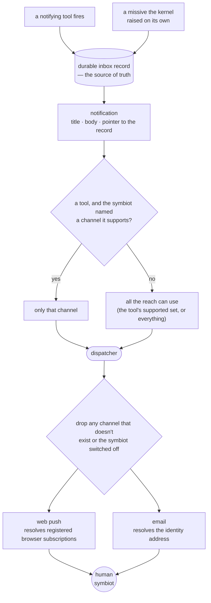

# notifications: how the kernel reaches the human symbiot

The kernel spends most of its life answering — words come in, words go out. But some of what it has to say isn't a reply to anything that was just asked: a reminder comes due, a missive it raised on its own is waiting, a follow-up it reached for after the fact. For those it doesn't wait to be opened; it reaches out. A **notification** is that reach — one message the kernel pushes toward the human symbiot rather than holding until they next look. (The reply to a line the symbiot *did* just send is a different, lighter thing — a content-free knock returned on the one channel that line arrived on, not a fan-out; that stays [the reply channel's](../services/adapters/push.py) job, `push.notify`.)

The whole point of this layer is that the reach doesn't hang on any single way of getting through. A phone can be asleep, a browser can have refused permission, a push service can drop a nudge on the floor. So a notification is **channel-agnostic**: one payload, delivered across every channel the symbiot has, so that no one provider's delivery odds decide whether the reach lands. It is the "double up first delivery" principle made structural — a second independent channel at the point of contact, always.

## one payload, many channels

A notification is a small, uniform thing: a short **title** and a **body**, plus a pointer back to the durable record the message already holds in the inbox. It carries the real content, not a placeholder — the words the symbiot is meant to read are in it.

Every channel takes that identical payload and renders it in its own medium. There is no per-channel content negotiation, no "this channel gets the summary and that one gets the full text" — the notification is the same everywhere, and a channel's only job is to deliver it the way its medium allows.

The durable inbox record stays the **source of truth**. A notification is a *copy* pushed outward, never the only place the content lives — so a channel that drops it, delays it, or surfaces it late costs the symbiot immediacy but never the message itself, which is always there to be read in the authed inbox. Every channel is, at bottom, a faster path to something the inbox already holds.

## what a channel is

A channel is a **transport that knows how to reach the symbiot its own way**. Two things define one: how it resolves its destinations for a given symbiot, and how it sends. [Web push](../services/adapters/push.py) resolves its destinations by looking up the browser subscriptions the symbiot has registered — there can be several (a laptop, a phone), or none. [Email](../services/adapters/email_client.py) resolves to the single address every symbiot carries on their identity row, guaranteed present. Same interface, two very different address books behind it.

Adding a channel later — Telegram, a calendar, an SMS gateway — is writing one more transport and registering it. Nothing else moves: the notification shape is already uniform, and every tool that notifies picks the new channel up for free.

### the two channels today, and why both carry content

The launch channels are web push and Gmail, and both carry the real content rather than a content-free knock. That decision runs against an old instinct worth spelling out, because the instinct is backwards.

Web push here began as a pure doorbell — a nudge that said only "traffic waiting," carried no words, and left the shell to wake and read the real thing from the authed inbox. That looked like the private choice. But a web push payload is **end-to-end encrypted**: the push service (Google's FCM, Mozilla's) relays ciphertext it cannot read, and only the subscribed browser holds the key. A Gmail message, by contrast, sits in **plaintext on Google's servers** indefinitely. So the channel that was kept content-free is in fact the *more* private of the two. Once reminder content is accepted into the symbiot's mail, keeping the encrypted push starved of content is conservatism with nothing left to guard.

Two real reasons once justified the doorbell, and neither needs a starved payload to answer. The first is the **lock screen** — a decrypted push can surface its words where a passing glance catches them; the second is a **dropped nudge** — push is best-effort and TTL-limited, so a payload that lived only in the push could be lost. Both are answered by the durable inbox standing behind every notification: it is always the source of truth, and the pushed copy is only ever the quicker way to it. So push carries content, and loses nothing by it.

## the rule: fan out by default, narrow by request

There is one rule, default-plus-opt-in:

- **Default.** Every notification fans out to *every channel the triggering tool supports*.
- **Per-tool supported set.** Each tool owns its own list of the channels it can notify over — which may be a subset of all the channels that exist. The reminder supports both web push and Gmail; a later tool might support only some.
- **Opt-in at input time.** The symbiot can name a channel in plain language when they ask — "remind me by email." If the tool that gets triggered supports that channel, *only* that channel fires. Otherwise — no channel named, or a channel named that this tool does not support — *every* channel the tool supports fires.
- A channel named **outside** a tool is idle. Words in a sentence that triggered nothing steer nothing; the opt-in only means something when it rides a tool, because that is the only place the request has somewhere to be carried.
- **A reach with no tool behind it fans out to everything.** A missive the kernel raised on its own — an enrichment follow-up, a line relayed from the World — has no tool and no request to narrow it, so it goes to every channel there is. There is nothing to opt into, so the default is simply "all."

A tool's supported list does double duty, and that is what keeps the rule honest: it is the set the tool's schema field is **constrained to** — so the model can only ever pick a channel the tool actually supports — and it is the set the default fan-out **sweeps**. "Only that one" and "all of them" both read from the same single list.

Two filters sit under all of that, and both are **silent** — the durable inbox record already stands, so a channel dropped here costs the symbiot immediacy, never the message. The first drops a channel that **doesn't exist**: a slug that names no real channel steers nothing. The second drops a channel the symbiot has **globally switched off** (see [turning a channel off](#turning-a-channel-off)): a channel disabled there is never fired, whatever asked for it and however it was phrased — so "email only" against a disabled email reaches no one at all, rather than erroring or falling back. Both narrow the set the same way, before any transport is touched, in the one dispatcher every reach goes through ([`notify.dispatch`](../services/loop/notify.py)).

## how the kernel notifies

Every reach goes through one entry point — [`notify.dispatch`](../services/loop/notify.py), given a notification, the symbiot, and the channels to use. The caller's only job is to decide those channels; the dispatcher owns everything after: the two silent filters, then handing the notification to each surviving channel's transport, each send best-effort and isolated so one that fails or has nothing to reach never robs the others or the caller.

A **tool** that reaches the symbiot declares its **supported-channel list** and an optional `channels` field in its argument schema, constrained to that list — when the symbiot's request names channels they land in that field, when it names none the field stays empty. The [reminder](../services/tools/reminder.py) is the first, and today the only, such tool: at the moment it fires (from the reminder sweep on the [worker](../services/loop/worker.py)) it raises its stored line as a [missive](../services/loop/missive.py) and dispatches across the channels the symbiot chose when they set it — **stored on the reminder row**, so they survive from the asking to the firing — or its whole supported set when they chose none.

A **reach with no tool** — [`missive.deliver`](../services/loop/missive.py) for a relayed line, or the enrichment follow-up on the worker — has nothing to narrow it, so it builds a notification and dispatches across every channel there is.

No caller touches web push or [email](../services/adapters/email_client.py) directly. Adding a third channel is a new transport and one more entry in the dispatcher's table; no tool and no caller changes, because the notification shape is already uniform.

## turning a channel off

The fan-out is generous by default — every channel, unless a tool narrowed it — so the symbiot needs a way to say "not this one, ever." The `/notifications` command is that standing switch: it lists every channel with whether it's on (all on until the symbiot turns one off) and flips one. A channel switched off is **globally disabled** — the dispatcher drops it from every reach before any transport is touched, so it is never fired again until switched back on, whichever tool fires and however the request is phrased. The preference is durable and per-symbiot ([`notification_prefs`](../services/memory/notification_prefs.py)); only the exceptions are stored, so a symbiot who never touches this is reachable everywhere, which is what the fan-out wants. The command is authed-only, the same as `/timezone`: a preference belongs to a particular symbiot, so there is no anonymous version, and the shell never shows it to a visitor.

## authenticated symbiots only

The whole layer is for authenticated symbiots, and that is less a limitation than the definition of a fan-out. Reaching every channel means resolving a symbiot's channels from their **identity** — the address on their row, the browser subscriptions tied to them. An anonymous, not-logged-in submission has no such address book behind it, so there is nothing to fan out to; its reply returns only to the single channel it arrived on. A notification is a reach toward someone the kernel knows, pointing back at a durable inbox that only a known symbiot has.
