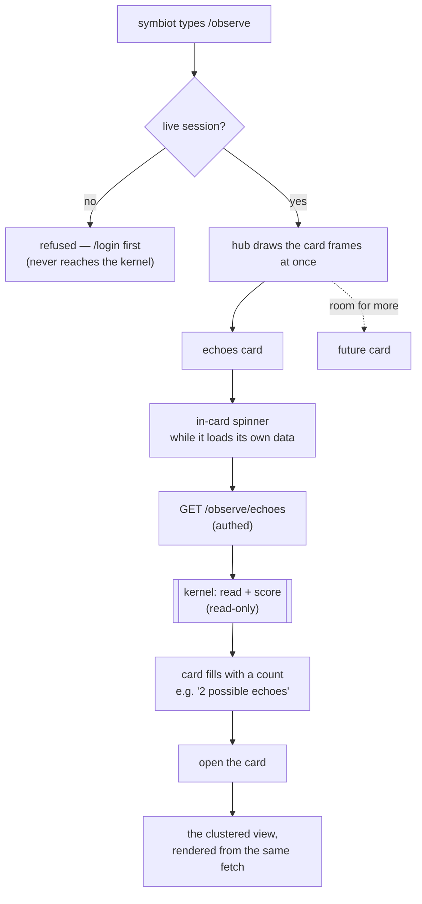
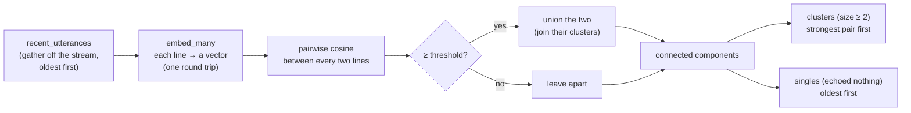

# observability: how the machine lets itself be watched

Most of what the kernel does, it does out of sight — a reply composed in a killable child, a fact filed by a background sweep, a follow-up reached for after the fact. That opacity is fine until something goes wrong in use, and then it is the whole problem: a failure happens in the symbiot's hands, they see it, and it leaves nothing behind for the machine to be read against afterward. Observability is the answer to that — a way for the machine to show what it has been doing, well enough that a fault leaves evidence rather than only a memory.

The first principle here is that **seeing is not fixing**. An observability surface reports; it never changes behaviour. Everything in this corner is a **read-only mirror** — it looks at what the machine has already said and done, touches no state the loop writes, and so can be opened at any time without any risk of making the machine behave worse. That safety is what lets it be built and used freely. The second principle follows the project's grain: don't decide in the abstract what a healthy machine looks like, decide it **in front of the evidence**. So the thresholds and windows these lenses use are knobs with sane defaults, meant to be tuned against real output rather than guessed at blind.

## the `/observe` surface: a hub of cards

`/observe` is not a single view. It is a **hub of cards**, each card a distinct lens onto something worth watching, with room for the corner to grow one card at a time. Today it holds exactly one inhabitant — the **echoes** card — and the frame is built to hold the rest as they are earned. This is the narrow-first shape made concrete: one door open, a wall ready for the others.

The command is authed-only, hidden from `/help` until there's a session, cut to the same cloth as [`/timezone`](../shell.os-joy.com/src/zone.ts) and [`/notifications`](../shell.os-joy.com/src/notifications.ts): a symbiot's own output is not an anonymous thing to show, so a caller with no live session is turned away. Opening the hub draws the card frames instantly; each card then **loads its own data independently**, behind a quiet in-card spinner, so no card blocks the hub or another card. That is the worker pool's "one slow unit must never freeze the whole" discipline, brought to the observe surface — and it is what lets future cards each light up on their own clock.

Because knowing how many echoes there are *is* the full comparison — you cannot count clusters without measuring every pair — the card's own load does the real work once, and opening the card then renders from what it already computed, so the click itself is instant.

## the echoes lens

The echoes card answers one question: *where have I said more or less the same thing twice?* Not word-for-word duplication, which a hash would catch in a line, but **semantic** redundancy — the same thought composed again in slightly different clothes, the kind of repeat a tired human reading their own scrollback slides right past. It is the lens onto the first real bug the running machine surfaced in use: replies, both the fast ones and the deep follow-ups, circling back to things already said.

Opened, it shows the redundancy **grouped into clusters** — the near-duplicates bundled under an echo heading with their similarity score, strongest first, and everything that echoed nothing listed plainly below. Grouping is what turns a scan into a glance.

### reading: the stream, and what each line's origin says

Everything the machine says lands in one place — the [conversation stream](../migrations/0014_conversation_memory.sql) (`conversation_item`), one row per utterance. The row does not copy the words; it **points** at where they live durably, and which pointer it carries also names the mechanism that produced the line. So the gather ([`observe.recent_utterances`](../services/observe.py)) is one read that resolves both the words and their origin for free:

- an **`intake_id`** → a **fast reply** (`quick`); the words are that intake row's `answer`, and the human line it answered is the row's `message`;
- a **`missive_id`** an [enrichment](../migrations/0015_enrichment_provenance.sql) row claims → a **deep follow-up** (`deep`); the words are the missive body, no trigger;
- any other **`missive_id`** → a **note** (`note`) — a reminder, a relayed line — the kernel raised on its own.

The lines come back oldest-first, the order the conversation ran and the order redundancy is easiest to see in.

### scoring: the embedder, pointed inward

The hard part is the *more-or-less*. Verbatim duplication is trivial; quasi-similarity lives in **meaning**, and measuring distance in meaning is exactly what the machine already does for [deep retrieval](../services/memory/deep_retrieval.py). So the lens points a tool it already owns **inward**: [`embedding.embed_many`](../services/adapters/embedding.py) turns each of the machine's own recent lines into a vector (as a `document`, so two of its own lines are compared symmetrically), and the cosine closeness between every pair is read. Lines at or above the [threshold](../services/observe.py) are joined into a cluster — **transitively**, via union-find, so a chain of near-duplicates lands in one group even when its endpoints aren't directly close — and a cluster's headline number is the strongest pair inside it. A line that echoes nothing stands alone.

None of this runs on the reply path. The embedding cost is paid **only when a symbiot opens the lens**, off the loop entirely, which is why the running app carries none of it and the in-card spinner is the honest signal that the machine is embedding-and-comparing right then, fresh.

### when the embedder is down: degrade, don't error

A read-only lens should never just fail in the symbiot's face. If the embedder is unreachable, the scoring pass **degrades rather than errors**: every line comes back a single, the answer is flagged `scored: false`, and the shell shows the plain chronological mirror with a quiet note that it couldn't measure similarity this time. The mirror still works; only the grouping is missing. Fewer than two lines can't echo at all, so scoring is skipped and the embedder is never even called.

## the knobs, and how they get tuned

Three knobs shape the echoes lens, and all three are defaults meant to move against real output, never guesses defended in the abstract:

- **the echo threshold** — the cosine closeness at or above which two lines count as an echo;
- **the window** — how many recent machine lines the lens reaches back over;
- **cross-kind echoes** — whether a fast reply echoing a deep follow-up counts (today it does; the clustering is blind to mechanism).

The threshold is the one that earned its tuning already, and it is a clean illustration of the observe-first ethic. The [by-hand smoke](../test/qa/0009_observe_echoes_smoke.py) files three paraphrases of one thought and one unrelated line, embeds them live, and prints the real pairwise numbers. They came back with a wide, clean gap: unrelated lines sit around **0.55–0.60**, clear paraphrases around **0.80–0.88**. The first default, 0.85, was set blind and sat too high in that gap — it clustered only the closest paraphrase pair and wrongly left an obvious third alone. Seeing the real numbers moved it to **0.75**, comfortably in the gap: low enough to catch a loose paraphrase, high enough to leave unrelated lines apart. The threshold wasn't decided in the abstract; it was decided in front of the evidence.

## where it lives

- **kernel** — [`services/observe.py`](../services/observe.py): the read (`recent_utterances`) and the scoring (`echoes`), the whole read side of the corner. [`main.py`](../main.py): the authed `GET /observe/echoes` route. [`services/adapters/embedding.py`](../services/adapters/embedding.py): `embed_many`, the batch embed the lens leans on. The protocol word `observe echoes` lives in [`core/protocol.py`](../core/protocol.py).
- **shell** — [`src/observe.ts`](../shell.os-joy.com/src/observe.ts): the `/observe` flow — the hub, the card's self-load, and the clustered render. The `cards` primitive that draws the bordered, keyboard-first hub lives in [`src/term.ts`](../shell.os-joy.com/src/term.ts), a sibling of `readLine` and `checklist`.
- **proof** — [`test/test_observe.py`](../test/test_observe.py) pins the gather, the clustering, the degrade path, and the route shape with the embedder faked; [`test/qa/0009_observe_echoes_smoke.py`](../test/qa/0009_observe_echoes_smoke.py) proves the real embedding actually clusters paraphrases against a live model, and is where the threshold is tuned.
