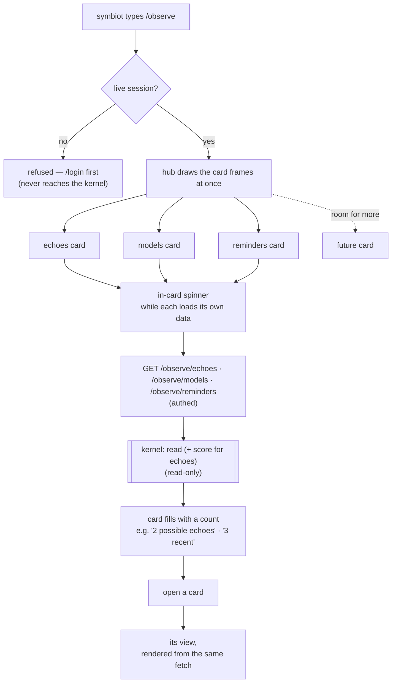
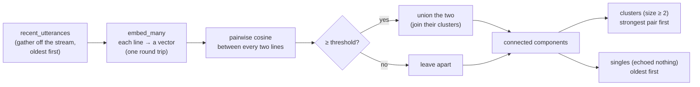

# observability: how the machine lets itself be watched

Most of what the kernel does, it does out of sight — a reply composed in a killable child, a fact filed by a background sweep, a follow-up reached for after the fact. That opacity is fine until something goes wrong in use, and then it is the whole problem: a failure happens in the symbiot's hands, they see it, and it leaves nothing behind for the machine to be read against afterward. Observability is the answer to that — a way for the machine to show what it has been doing, well enough that a fault leaves evidence rather than only a memory.

The first principle here is that **seeing is not fixing**. An observability surface reports; it never changes behaviour. Everything in this corner is a **read-only mirror** — it looks at what the machine has already said and done, touches no state the loop writes, and so can be opened at any time without any risk of making the machine behave worse. That safety is what lets it be built and used freely. The second principle follows the project's grain: don't decide in the abstract what a healthy machine looks like, decide it **in front of the evidence**. So the thresholds and windows these lenses use are knobs with sane defaults, meant to be tuned against real output rather than guessed at blind.

## the `/observe` surface: a hub of cards

`/observe` is not a single view. It is a **hub of cards**, each card a distinct lens onto something worth watching, with room for the corner to grow one card at a time. Today it holds three — the **echoes** card, the **models** card, and the **reminders** card — and the frame is built to hold the rest as they are earned. This is the narrow-first shape made concrete: the doors that are open are open, a wall ready for the others.

The command is authed-only, hidden from `/help` until there's a session, cut to the same cloth as [`/timezone`](../../shell.os-joy.com/src/zone.ts) and [`/notifications`](../../shell.os-joy.com/src/notifications.ts): a symbiot's own output is not an anonymous thing to show, so a caller with no live session is turned away. Opening the hub draws the card frames instantly; each card then **loads its own data independently**, behind a quiet in-card spinner, so no card blocks the hub or another card. That is the worker pool's "one slow unit must never freeze the whole" discipline, brought to the observe surface — and it is what lets future cards each light up on their own clock.

```mermaid
flowchart TD
    U["symbiot types /observe"] --> S{"live session?"}
    S -->|no| REF["refused — /login first<br/>(never reaches the kernel)"]
    S -->|yes| HUB["hub draws the card frames at once"]
    HUB --> C1["echoes card"]
    HUB --> C2["models card"]
    HUB --> C3["reminders card"]
    HUB -.->|room for more| C4["future card"]
    C1 --> SPIN["in-card spinner<br/>while each loads its own data"]
    C2 --> SPIN
    C3 --> SPIN
    SPIN --> GET["GET /observe/echoes · /observe/models · /observe/reminders<br/>(authed)"]
    GET --> KERNEL[["kernel: read (+ score for echoes)<br/>(read-only)"]]
    KERNEL --> SUM["card fills with a count<br/>e.g. '2 possible echoes' · '3 recent'"]
    SUM --> OPEN["open a card"]
    OPEN --> VIEW["its view,<br/>rendered from the same fetch"]
```

Because knowing how many echoes there are *is* the full comparison — you cannot count clusters without measuring every pair — the card's own load does the real work once, and opening the card then renders from what it already computed, so the click itself is instant.

## the echoes lens

The echoes card answers one question: *where have I said more or less the same thing twice?* Not word-for-word duplication, which a hash would catch in a line, but **semantic** redundancy — the same thought composed again in slightly different clothes, the kind of repeat a tired human reading their own scrollback slides right past. It is the lens onto the first real bug the running machine surfaced in use: replies, both the fast ones and the deep follow-ups, circling back to things already said.

Opened, it shows the redundancy **grouped into clusters** — the near-duplicates bundled under an echo heading with their similarity score, strongest first, and everything that echoed nothing listed plainly below. Grouping is what turns a scan into a glance.

Beside the clusters rides a count of the other side of the coin: how many deep follow-ups the [echo guard](context-engineering.md#not-repeating-itself-the-lull-upstream-the-echo-guard-downstream) **held back** before delivery, all-time ([`observe.held_back_count`](../services/observe.py), read off the `echo_suppressed` stamp on the enrichment row). The lens sees the redundancy that got through; this says how much was stopped. Without it the card would report the muzzle's failures and stay silent about its successes, which reads as a worse machine than the one actually running.

### reading: the stream, and what each line's origin says

Everything the machine says lands in one place — the [conversation stream](../migrations/0014_conversation_memory.sql) (`conversation_item`), one row per utterance. The row does not copy the words; it **points** at where they live durably, and which pointer it carries also names the mechanism that produced the line. So the gather ([`observe.recent_machine_utterances`](../services/observe.py)) is one read that resolves both the words and their origin for free:

- an **`intake_id`** → a **fast reply** (`quick`); the words are that intake row's `answer`, and the human line it answered is the row's `message`;
- a **`missive_id`** an [enrichment](../migrations/0015_enrichment_provenance.sql) row claims → a **deep follow-up** (`deep`); the words are the missive body, no trigger;
- any other **`missive_id`** → a **note** (`note`) — a reminder, a relayed line — the kernel raised on its own.

The lines come back oldest-first, the order the conversation ran and the order redundancy is easiest to see in.

### scoring: the embedder, pointed inward

The hard part is the *more-or-less*. Verbatim duplication is trivial; quasi-similarity lives in **meaning**, and measuring distance in meaning is exactly what the machine already does for [deep retrieval](../services/memory/deep_retrieval.py). So the lens points a tool it already owns **inward**: [`embedding.embed_many`](../services/adapters/embedding.py) turns each of the machine's own recent lines into a vector (as a `document`, so two of its own lines are compared symmetrically), and the cosine closeness between every pair is read. Lines at or above the [threshold](../services/echo.py) are joined into a cluster — **transitively**, via union-find, so a chain of near-duplicates lands in one group even when its endpoints aren't directly close — and a cluster's headline number is the strongest pair inside it. A line that echoes nothing stands alone.

The closeness and the threshold themselves live in [`services/echo.py`](../services/echo.py), a measure of *more-or-less-the-same* shared by two callers so they can never drift apart: this lens, which **sees** the redundancy, and the enrichment guard ([`enrichment.is_echo_of_prior`](../services/memory/enrichment.py)), which **stops** it — refusing to send a deep follow-up that echoes one already sent. The lens groups a whole page into clusters; the guard needs only the nearest prior, so it takes the smaller half of the same measure. The instrument built to make the redundancy legible became the definition the fix enforces — the observe-first loop closing on itself.

```mermaid
flowchart LR
    G["recent_utterances<br/>(gather off the stream,<br/>oldest first)"] --> E["embed_many<br/>each line → a vector<br/>(one round trip)"]
    E --> P["pairwise cosine<br/>between every two lines"]
    P --> T{"≥ threshold?"}
    T -->|yes| J["union the two<br/>(join their clusters)"]
    T -->|no| K["leave apart"]
    J --> CC["connected components"]
    K --> CC
    CC --> CL["clusters (size ≥ 2)<br/>strongest pair first"]
    CC --> SG["singles (echoed nothing)<br/>oldest first"]
```

None of this runs on the reply path. The embedding cost is paid **only when a symbiot opens the lens**, off the loop entirely, which is why the running app carries none of it and the in-card spinner is the honest signal that the machine is embedding-and-comparing right then, fresh.

### when the embedder is down: degrade, don't error

A read-only lens should never just fail in the symbiot's face. If the embedder is unreachable, the scoring pass **degrades rather than errors**: every line comes back a single, the answer is flagged `scored: false`, and the shell shows the plain chronological mirror with a quiet note that it couldn't measure similarity this time. The mirror still works; only the grouping is missing. Fewer than two lines can't echo at all, so scoring is skipped and the embedder is never even called.

## the knobs, and how they get tuned

Three knobs shape the echoes lens, and all three are defaults meant to move against real output, never guesses defended in the abstract:

- **the echo threshold** — the cosine closeness at or above which two lines count as an echo;
- **the window** — how many recent machine lines the lens reaches back over;
- **cross-kind echoes** — whether a fast reply echoing a deep follow-up counts (today it does; the clustering is blind to mechanism).

The threshold is the one that earned its tuning already, and it is a clean illustration of the observe-first ethic. The [by-hand smoke](../test/qa/0009_observe_echoes_smoke.py) files three paraphrases of one thought and one unrelated line, embeds them live, and prints the real pairwise numbers. They came back with a wide, clean gap: unrelated lines sit around **0.55–0.60**, clear paraphrases around **0.80–0.88**. The first default, 0.85, was set blind and sat too high in that gap — it clustered only the closest paraphrase pair and wrongly left an obvious third alone. Seeing the real numbers moved it to **0.75**, comfortably in the gap: low enough to catch a loose paraphrase, high enough to leave unrelated lines apart. The threshold wasn't decided in the abstract; it was decided in front of the evidence.

## the models lens

The second card answers a question the machine had, until now, kept no durable record of at all: *whose words did I actually get?*

Every generative call resolves a **role** to a model and then walks a [fallback ladder](llms.md) — Google, then its Scaleway rung, then that rung's Mistral catch, then the local Ollama floor. So the model that answers is routinely not the one the role names, and the reply itself never says which one it was. A reply composed by the humbler rung at the bottom of the ladder reads exactly like one composed at the top: a little thinner, a little off-voice, and completely unattributable after the fact. The symbiot experiences that as the machine having a bad day for no reason anyone can point at.

That fact did exist — as a log line ([`llm._served`](../services/adapters/llm.py)), which is to say it existed until the log rotated, and never on a surface. The card is that line made durable ([migration `0026`](../migrations/0026_generative_call_ledger.sql), written through [`memory/generative_call`](../services/memory/generative_call.py)), and its whole subject is **two names side by side**: the model the role resolved to, and the model that actually answered. Equal, the primary answered and the ladder never moved. Different, a provider was down and something else wrote the words. Set them beside each other and a quiet week of fall-throughs is legible at a glance; keep only one of them and it is invisible either way.

Opened, the card leads with a **tally of which models actually answered**, counted off the *served* name and never the requested one — counting what was asked for would report the intent and hide the fact. Under it sits one line per call: its kind, when it was made, the model, and how much came back. A call the ladder never moved on prints one model, dim, because that is the ordinary case and should read as quiet; a call that fell through prints both, joined by an arrow and coloured, because that line is the only place the difference shows at all.

Alongside each call rides the length of what came back — measured on the model's **raw** answer, wrapper and all, because the output ceiling it is the tell for applies to that raw body. It is the cheapest possible signal for the failure this attribution was built for: a model that degenerates mid-reply runs the same characters until it hits its own ceiling, so a reply sitting at the cap is degenerate on its face. It is a length and never the words — the ledger records who answered and how much they said, never what was said, since the words already live durably where they belong and the echoes card is where they are read.

### the two roles it covers, and why not the other six

The card is narrowed to **`reply` and `enrich`** — the fast answer and the deep follow-up. That is not an arbitrary sample; it is the line between the calls whose output the symbiot *reads* and the calls that are the machine thinking. Every other role is an internal judgment: a re-rank, a tool decision, a fold. The question this card asks is "whose words did I get?", not "what did the machine think along the way", and a ledger padded with re-ranks would answer neither well.

A role joins by **naming itself at its call site** — `llm.generate_json(..., role="reply")` — rather than by anything enumerating roles centrally. Naming the role is also what resolves the model from the store, so the two are one act: a call that says what job it is doing gets its model resolved *and* gets recorded, and a call that reaches for a model name directly gets neither. Widening the card later is a keyword at a call site and a word in `GENERATIVE_CALL_ROLES`, never a migration.

### the one card that is not the symbiot's own

Every other read in this corner is scoped to the symbiot, because it reports their content. This one carries no `symbiot_id` at all, and that is a decision rather than an oversight — pinned by a test so nobody is right to "fix" it. Which model served a call is a property of the **machine and the clouds it can reach**, exactly like the model catalog and the role assignments it is read against, which are box-level too and edited through the box-level [`/models`](llms.md) command. Nothing in a row is anyone's content: a role, two model names, a provider, a length, an instant.

### the write that must never cost a reply

The record is written from the model boundary, and two properties keep it from ever becoming a liability there. It opens its **own short-lived connection** rather than taking one, because the reply is composed inside a spawned child process ([`execution.run_with_deadline`](../services/loop/execution.py)) that inherits no pool — the same constraint the model resolver already answers the same way. And it **never raises**: a failed write is logged and swallowed, so a database briefly unreachable costs a row of audit and never a reply. A ledger is an account of the work, not a step in it.

One subtlety earns its place. The row is written **before** the reply is validated against its schema, not after — because a reply that breaks its schema is precisely the case the attribution was built for, and writing afterward would lose the name of the model that produced it at exactly the moment it matters most.

## the reminders lens

The third card answers a different question — not *what did I repeat?* but *what did I do that no one asked for?* When the [reminder tool](tool-calling.md) grew too eager and began scheduling reminders off lines that only mentioned a future task, sharpening its decision was a judgment call, and a judgment call needs evidence to be trusted. This card is that evidence: the most recently scheduled reminders, newest first, each shown **with the human line that triggered it**. The pairing is the whole point — a reminder sitting under a message that never asked to be reminded is the over-eagerness caught in the act, a row to read rather than a suspicion to argue about.

It is a plainer lens than echoes: no embedder, no scoring, just a read. [`observe.recent_reminders`](../services/observe.py) joins the [reminder ledger](../migrations/0017_tools_and_reminders.sql) to its triggering [intake](../migrations/0002_intake.sql) and hands back its id, the line said, the line to be said back, when it fires, where it stands (pending, fired, or cancelled) and the channels it rides. The fire and set times are stamped on the symbiot's own clock, so the shell prints them as-is. Read-only and off the loop's path like the rest of the corner. Its window — how many reminders back it reaches — is the same kind of un-tuned default as the echoes window: generous for now, to be set against real use rather than guessed at blind.

**That join is a LEFT join, and the reason is the sort that hides.** It used to be an inner one, resting on the fact that every reminder was born from a message — true while that was the only way one could exist, false the moment a reminder could be [typed straight in](tool-calling/reminders.md#the-two-ways-in). An inner join does not complain about that; it drops the row. Every directly-made reminder would have been absent from the audit surface, and the card would have gone on looking complete while reporting a subset — which is worse than no card at all. So: a left join, and a reminder with no line behind it reads as one the symbiot set themselves, which is the distinction the card exists to draw anyway.

## the declines: watching the one judgment that writes nothing

The reminders card carries a second list under the reminders, and it is there for the mirror image of the same mistake. The card above catches a reminder set when none was asked for. This catches the opposite: a reminder **not** set, because the machine judged it was already holding one.

That judgment — the [deduplication](tool-calling/reminders.md#deduplication-the-first-decision-taken-on-what-was-observed) — is the first decision the machine takes on what it *observed* rather than on what the symbiot *said*, and it is the only one that writes nothing at all. Everything else leaves a mark: scheduling writes a row, cancelling stamps it, firing stamps it. So without a row of its own, the judgment most worth watching would be the one nobody could see, which is backwards.

The failure worth catching is it reading "call the dentist about the referral letter" as the same thing as "call the dentist", filing nothing, and the symbiot never learning it made that call. So a decline ([migration `0024`](../migrations/0024_reminder_declines.sql)) carries **both wordings**: the message that asked, and the standing reminder it was matched to. A counter on the matched reminder would have been cheaper and would have dropped the only field worth having, since the whole failure mode is two differently worded intents collapsing into one, and the wording is the evidence. [`observe.recent_declines`](../services/observe.py) reads them newest first, reaching the symbiot through the reminder the decline matched.

A judging call that could not run at all is *not* here. It goes to the log, because it is an infrastructure hiccup and not a judgment about the symbiot's words — and because the reminder was set anyway, so there is no absence to account for.

The value the card earns is the next round of hardening. The reminder fix sharpened the decision prompt on reasoning alone; the real false positives on either list are the concrete examples that would sharpen it further — the observe-first loop again, the instrument that makes a fault legible feeding the fix that removes it.

## where it lives

- **kernel** — [`services/observe.py`](../services/observe.py): the reads behind all three cards — `recent_machine_utterances`, the `machine_echoes` scoring and `held_back_count` for the first, `recent_generative_calls` for the second, `recent_reminders` and `recent_declines` for the third — the whole read side of the corner. [`services/echo.py`](../services/echo.py): the cosine measure and the echo threshold, shared with the enrichment guard so lens and fix agree on *more-or-less-the-same*. [`services/memory/generative_call.py`](../services/memory/generative_call.py): the write side of the models card's ledger, called from the model boundary the moment a rung answers. [`main.py`](../main.py): the authed `GET /observe/echoes`, `GET /observe/models`, and `GET /observe/reminders` routes. [`services/adapters/embedding.py`](../services/adapters/embedding.py): `embed_many`, the batch embed the echoes lens leans on. The protocol words `observe echoes`, `observe models`, and `observe reminders` live in [`core/protocol.py`](../core/protocol.py).
- **shell** — [`src/observe.ts`](../../shell.os-joy.com/src/observe.ts): the `/observe` flow — the hub, each card's self-load, and the three renders (the clustered echoes view, the models tally with its calls beneath it, and the reminders list with the declines beneath it). The `cards` primitive that draws the bordered, keyboard-first hub lives in [`src/term.ts`](../../shell.os-joy.com/src/term.ts), a sibling of `readLine` and `checklist`.
- **proof** — [`test/test_observe.py`](../test/test_observe.py) pins all three reads: the echoes gather, clustering, degrade path, and route shape with the embedder faked, the reminders pairing, ordering, states and route gate, the left join that keeps a directly-typed reminder on the card, and the declines' own scoping; and for the models card, the two names carried side by side, the mechanism words shared with the echoes card, the roles deliberately left out, and the box-level scoping pinned as a decision. [`test/test_llm.py`](../test/test_llm.py) pins the write at the boundary: a named role records the rung that *actually* answered after a fall-through, and a call that names no role is left out of the ledger entirely. [`test/qa/0009_observe_echoes_smoke.py`](../test/qa/0009_observe_echoes_smoke.py) proves the real embedding actually clusters paraphrases against a live model, and is where the threshold is tuned; [`test/qa/0010_observe_reminders_smoke.py`](../test/qa/0010_observe_reminders_smoke.py) drives the real two-gate seam against live models, proving the sharpened decision schedules an explicit request and declines a bare mention, then renders the pairing the card shows.
