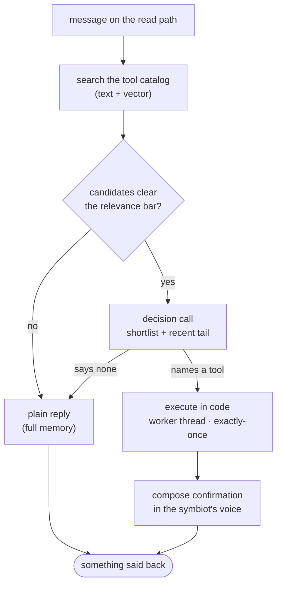
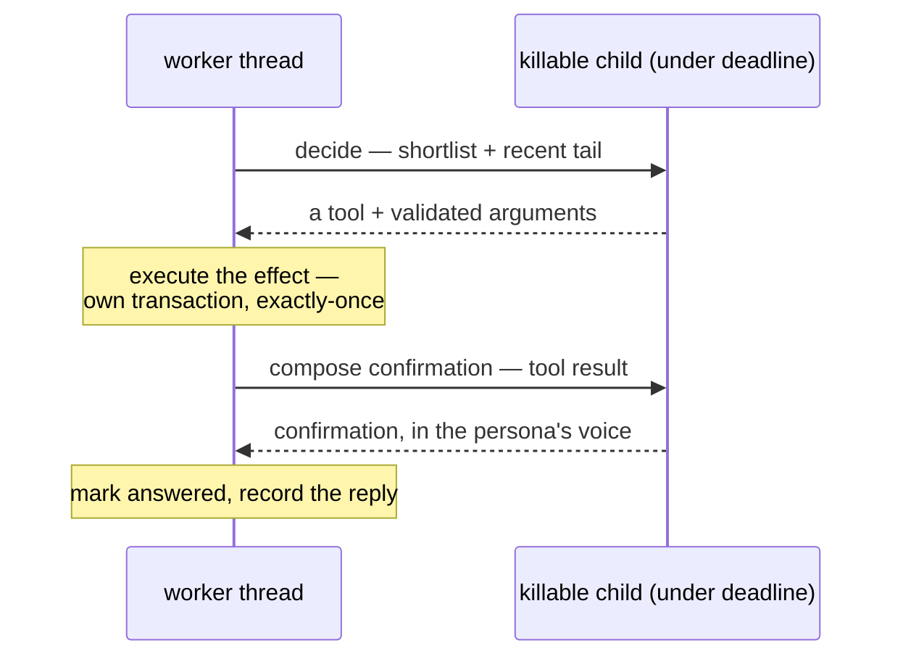

# tool-calling: how the symbiot decides to act, and how code carries the act out

Everything the read path does is speech — it answers, it follows up, it reaches back through the diary. Tool-calling is the one seam where the loop stops talking and *acts*: changes something in the world on the symbiot's behalf. This document is the design of that seam — how a tool is defined, how the symbiot decides to reach for one, and the single invariant the whole thing is built to hold: **the model decides and describes; code does.**

## the principle: our boundary, not a provider's

Every generative provider now ships a native "function calling" API — a `tools` array, a `tool_calls` field, a multi-turn protocol for feeding results back. The kernel deliberately does **not** build on it. Native function calling is, underneath, the same thing the kernel already does through [`llm.generate_json`](../services/llm.py): constrained decoding to a strict schema, re-validated on the way back. What it adds on top is a provider-specific dispatch convention and message shape — and that surface changes over time and differs between Scaleway, Mistral, and Ollama.

So tool-calling rides the kernel's own structured-output boundary, the one the fold, the ontology's concept calls, and the deep pass's gate already cross. The decision of *which action to take* is expressed in our own Pydantic shape and validated here, and only the thin per-tier call layer in `llm.py` ever touches a provider's specifics. The internals stay legible in our vocabulary rather than hostage to an API surface we don't own. Native function calling becomes worth adopting only when the kernel needs what it is actually *for* — many tools chained in a multi-step loop, the model acting on one result before choosing the next — which is a long way past where this starts.

## what a tool is, and where it lives

A tool is four things, joined by its name:

- a **name** — what the model emits when it chooses the tool;
- a **description** — the prose the model reads to judge whether the tool fits;
- an **argument schema** — a Pydantic model, the shape the decoder is bound to and the reply is validated against;
- an **executor** — the Python callable that carries out the effect.

Those four do not all live in one place, and the split is the point. The first three — the tool's *descriptor* — live in the store as a searchable row with an embedding of the description. The executor is code, in a registry keyed by name. **The store is the index you search; the code registry is the dispatch table you land on; the name is the join between them.** This is what makes "code executes, never the model" structurally true rather than a promise: the model can only ever produce a name, and a name resolves to a callable we wrote. An effect can never be data the model emits.

## keeping the catalog in sync

The code registry is the source of truth for *which tools exist*. The store's catalog is derived from it, never hand-edited. On startup the kernel reconciles the two: for each registered tool it upserts the descriptor row and re-embeds the description if it changed, so a tool's searchable form always matches the code that will run it. Adding a tool is adding a registry entry; the catalog row follows from it.

## the flow: retrieve, decide, act, speak

A message travels the ordinary read path — its memory gathered on the worker's thread — and the tool seam is one additive fork in that path, invisible to the overwhelming majority of messages that ask for nothing to be done.

**Retrieve, and let the retrieval be the gate.** Before anything is composed, the message is embedded and matched against the tool catalog (text and vector). That search *is* the gate: when nothing clears the relevance bar, the message is an ordinary one and takes the ordinary reply path untouched — no decision call spent, no machinery in the way. The catalog search is coarse recall by design; its job is to not miss a candidate, not to be sure.

**Decide, on a shortlist, with the recent thread in view.** When the search surfaces candidates, one lightweight call crosses the structured-output boundary carrying just that shortlist and the recent conversation tail — not the full diary. The tail is there because arguments often refer back: "remind me about *that* at six" only resolves against what was just said. The call answers with a flat decision schema — a `tool` field naming one of the shortlisted tools or `"none"`, plus that tool's arguments as nullable fields (flat, not a root-level union, so all three strict decoders handle it reliably). `"none"` is the precise judgment correcting the coarse recall — the same two-stage shape the ontology re-ranker uses, where vector recall proposes and the model rejects. A `"none"` hands off to the ordinary reply, which has the full memory to answer well; the decision call is never asked to compose the reply itself, so it stays cheap on every message that merely sits *near* a tool.

**Act, in code, exactly once.** When a tool is named, its executor runs — on the worker's own thread, in its own transaction, never inside the killable child. The effect is written durably and guarded exactly-once against the message that triggered it (see below), so a retried message re-fires nothing.

**Speak, always.** A second call then composes the confirmation the human sees, in the symbiot's own voice, speaking the executor's *result* — the facts come from the tool, the voice from the persona; the model never re-invents what the tool decided. Every path terminates in something said back: there are two off-ramps to a plain reply (the search cleared nothing, or the decision returned `"none"`) and one tool-fired path, and all three end in speech. No silent execution, no dead end — the same law the rest of the kernel holds, that nothing reaches the symbiot as silence.

## two calls, on purpose

The decision and the reply are separate model calls. The decision is deliberately memory-light — the shortlist and the recent tail, nothing more — so it is cheap to make on every message that surfaces a candidate. The reply is memory-rich — the full diary and conversation — so it answers well. Collapsing them into one call would force the full memory into every decision, paying the heavy cost even to conclude "not a tool." The price of keeping them apart is that a message which *looked* tool-shaped but was not spends two calls (decide → `"none"` → compose) instead of one. On the small set of messages that sit near a tool without invoking one, that is the accepted trade.

## fork discipline: where each step runs

The composing calls are pure model work and run inside the killable child under the intake deadline, exactly as the ordinary reply already does. The executor's write does **not** run there. The forked child can be severed at the deadline mid-run, so a side effect placed inside it could be half-done and unrecoverable. The effect runs back on the worker's thread, in an explicit transaction — the same discipline the context-gathering already follows in keeping database work out of the child. The shape is: child *decides* → worker thread *executes* → child *composes the confirmation*.

## exactly-once

A message can be re-run: if the deadline bites or the process crashes, the reconcile sweep requeues it and a worker runs the whole flow again. Without a guard, a first run that scheduled the effect and then failed on the confirmation call would, on retry, fire the effect a second time. So tool execution is made exactly-once the way the rest of the kernel pins it — in the database, not in the loop being careful. Each effect is tied to the id of the message that triggered it under a uniqueness constraint, the same shape the enrichment pass uses. On a retry the executor's write conflicts and is a no-op; the flow sees the effect already stands and simply re-composes the confirmation from it. The effect fires once; only the spoken confirmation is re-derived, which is harmless.

## the first tool

The registry's first and only inhabitant is a one-shot reminder: `schedule_reminder(message, when)`. It is the cleanest possible first action — it needs no external driver and no third-party credential, only a durable row in our own store and the reply path already built, so what is under test is the machinery of acting rather than the plumbing of an integration. Its executor resolves the time to a concrete moment in the symbiot's timezone and persists it; a due-check later fires the stored message back over the reply path, itself exactly-once per due moment. The catalog of one exercises the retrieval and the registry trivially, but the contract holds from the first tool, so the second is a new entry and a new row, not a rewrite.
