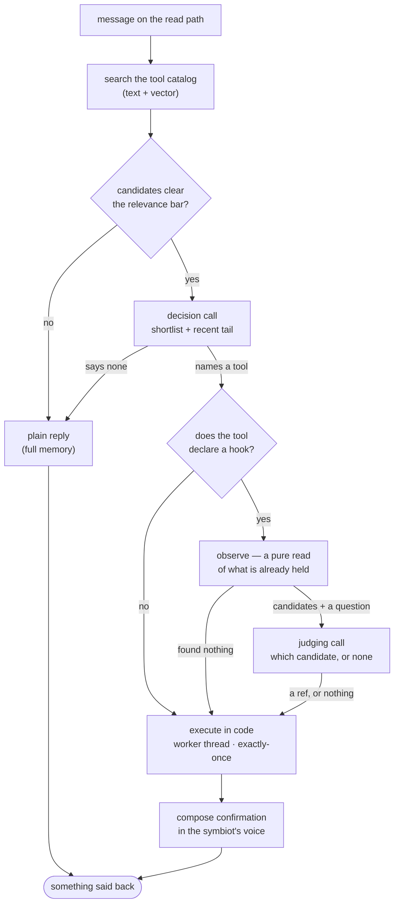
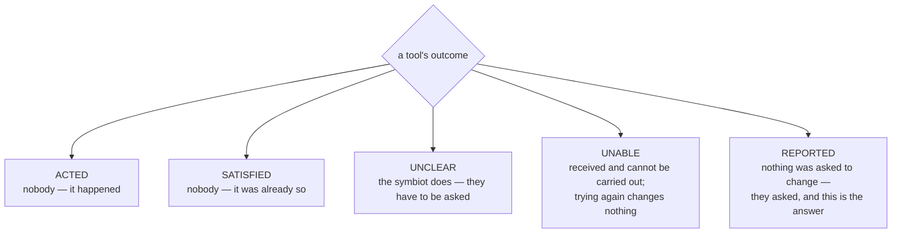
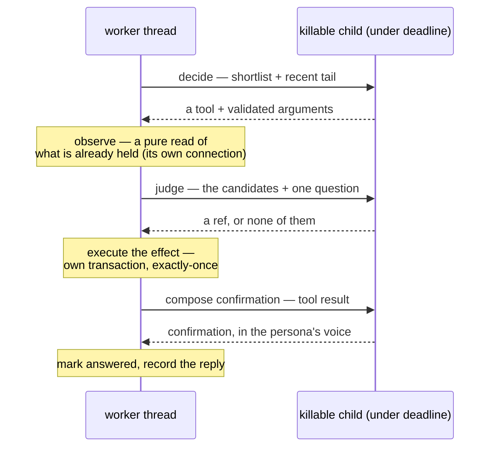

# tool-calling: how the symbiot decides to act, and how code carries the act out

Everything the read path does is speech — it answers, it follows up, it reaches back through the diary. Tool-calling is the one seam where the loop stops talking and *acts*: changes something in the world on the symbiot's behalf. This document is the design of that seam — how a tool is defined, how the symbiot decides to reach for one, and the single invariant the whole thing is built to hold: **the model decides and describes; code does.**

## the principle: our boundary, not a provider's

Every generative provider now ships a native "function calling" API — a `tools` array, a `tool_calls` field, a multi-turn protocol for feeding results back. The kernel deliberately does **not** build on it. Native function calling is, underneath, the same thing the kernel already does through [`llm.generate_json`](../services/adapters/llm.py): constrained decoding to a strict schema, re-validated on the way back. What it adds on top is a provider-specific dispatch convention and message shape — and that surface changes over time and differs between Google, Scaleway, Mistral, and Ollama.

So tool-calling rides the kernel's own structured-output boundary, the one the fold, the ontology's concept calls, and the deep pass's gate already cross. The decision of *which action to take* is expressed in our own Pydantic shape and validated here, and only the thin per-tier call layer in `llm.py` ever touches a provider's specifics. The internals stay legible in our vocabulary rather than hostage to an API surface we don't own. Native function calling becomes worth adopting only when the kernel needs what it is actually *for* — many tools chained in a multi-step loop, the model acting on one result before choosing the next — which is a long way past where this starts.

## what a tool is, and where it lives

A tool is four things joined by its name, and optionally a fifth:

- a **name** — what the model emits when it chooses the tool;
- a **description** — the prose the model reads to judge whether the tool fits;
- an **argument schema** — a Pydantic model, the shape the decoder is bound to and the reply is validated against;
- an **executor** — the Python callable that carries out the effect;
- an **observe hook**, when the tool needs to know something before it acts — a read that gathers the handful of records its act would touch and phrases one question about them, which a small judging call answers before the executor runs (see [look](#the-flow-retrieve-decide-look-act-speak)).

Those first four do not all live in one place, and the split is the point. The first three — the tool's *descriptor* — live in the store as a searchable row with an embedding of the description. The executor is code, in a registry keyed by name. **The store is the index you search; the code registry is the dispatch table you land on; the name is the join between them.** This is what makes "code executes, never the model" structurally true rather than a promise: the model can only ever produce a name, and a name resolves to a callable we wrote. An effect can never be data the model emits.

## keeping the catalog in sync

The code registry is the source of truth for *which tools exist*. The store's catalog is derived from it, never hand-edited. On startup the kernel reconciles the two: for each registered tool it upserts the descriptor row and re-embeds the description if it changed, so a tool's searchable form always matches the code that will run it. Adding a tool is adding a registry entry; the catalog row follows from it.

## the flow: retrieve, decide, look, act, speak

A message travels the ordinary read path — its memory gathered on the worker's thread — and the tool seam is one additive fork in that path, invisible to the overwhelming majority of messages that ask for nothing to be done.

```mermaid
flowchart TD
    msg["message on the read path"] --> search["search the tool catalog<br/>(text + vector)"]
    search --> gate{"candidates clear<br/>the relevance bar?"}
    gate -->|no| reply["plain reply<br/>(full memory)"]
    gate -->|yes| decide["decision call<br/>shortlist + recent tail"]
    decide -->|says none| reply
    decide -->|names a tool| hook{"does the tool<br/>declare a hook?"}
    hook -->|no| exec["execute in code<br/>worker thread · exactly-once"]
    hook -->|yes| look["observe — a pure read<br/>of what is already held"]
    look -->|found nothing| exec
    look -->|candidates + a question| judge["judging call<br/>which candidate, or none"]
    judge -->|a ref, or nothing| exec
    exec --> confirm["compose confirmation<br/>in the symbiot's voice"]
    reply --> out(["something said back"])
    confirm --> out
```

**Retrieve, and let the retrieval be the gate.** Before anything is composed, the message is embedded and matched against the tool catalog (text and vector). That search *is* the gate: when nothing clears the relevance bar, the message is an ordinary one and takes the ordinary reply path untouched — no decision call spent, no machinery in the way. The catalog search is coarse recall by design; its job is to not miss a candidate, not to be sure.

**Decide, on a shortlist, with the recent thread in view.** When the search surfaces candidates, one lightweight call crosses the structured-output boundary carrying just that shortlist and the recent conversation tail — not the full diary. The tail is there because arguments often refer back: "remind me about *that* at six" only resolves against what was just said. The call answers with a flat decision schema — a `tool` field naming one of the shortlisted tools or `"none"`, plus that tool's arguments as nullable fields (flat, not a root-level union, so all three strict decoders handle it reliably). `"none"` is the precise judgment correcting the coarse recall — the same two-stage shape the ontology re-ranker uses, where vector recall proposes and the model rejects. A `"none"` hands off to the ordinary reply, which has the full memory to answer well; the decision call is never asked to compose the reply itself, so it stays cheap on every message that merely sits *near* a tool.

**Look, before leaping — for the tools that want to.** This is the step that makes a decision contingent on what the machine **observed** rather than only on what the symbiot **said**. "Remind me to email Sam" is a perfectly good sentence in isolation — whether it is a *duplicate* is a fact about the world, not about the words. Same for "move the dentist one to Thursday": which row is meant is a fact about what is held. Neither can be settled by a single forward pass over a sentence, however good the model. So a tool that needs to know something before it acts declares a second function beside its executor — an **observe hook** — and the seam runs it first.

The hook is a read and only a read. It runs on the worker's own thread, before the executor, handed the same arguments the decision extracted; it writes nothing, which is what makes it safe to run on every message that reaches a tool declaring one. A tool that declares no hook is single-pass: the decision names it, its executor runs, and neither of the two steps below happens at all.

**What the hook hands back is a question and a shortlist.** Two parts, and both matter:

- **The question**, phrased by the tool itself, because one piece of machinery serves opposite asks — *"is one of these the same intent as what they just asked for?"* for the deduplication, *"which of these are they pointing at?"* for a cancel or an edit by language. Only the tool knows which it means, so only the tool writes the question.
- **The candidates**, which are what the hook actually found, already windowed, ranked and capped by code rather than handed over whole for a model to wade through. Each one is a pair: a **ref**, the row's own id — a handle *code* produced, never a string a model composed — and a one-line description in plain words, which is the only part of the candidate the judge ever reads.

A hook that finds nothing worth judging hands back nothing at all, and that costs nothing: no judging call is spent when there is nothing to judge, so the common case — a message about something the machine holds no record of — costs no more than a tool with no hook at all.

**One small judging call answers that question, and nothing else.** It sees the symbiot's message, the candidates as numbered lines, the hook's question, and the local time — that last because every candidate carries a time, and whether two of them are "the same one" often turns on whether they are the same afternoon. It answers with one of the numbers offered, or with null for *none of these*. Nothing else is in the prompt: no persona, no diary, no conversation tail, because none of that helps this judgment and all of it costs. That spareness is what makes the step cheap enough to spend on every message reaching a hooked tool, and cheap on a small local model too.

**What that answer *means* is the executor's to decide, because the same answer means opposite things.** The judge only ever says "this one" or "none"; it never says what to do. So the verdict travels to the executor as a ref or as nothing, and each tool reads it its own way:

- `schedule_reminder` reads a named ref as *already held*, and so declines to act — nothing is written, the decline is recorded so the judgment can be audited later, and the symbiot is told what already stands. A verdict of nothing is the ordinary case, and it schedules.
- `cancel_reminder` reads a named ref as *the row to act on*, and reads nothing as "I can't tell which one is meant" — so it asks, rather than picking one of several and calling off the wrong reminder.

It is deliberately **one step and not a loop** — bounded, of known shape, adding at most one model call, and never an unbounded chain of act-then-look-again. That restraint is the point: this is the narrowest possible shape that lets the machine look before it leaps.

Two things hold the step honest, and they are worth stating one at a time.

**The judge can only ever point at a row that code found.** Its answer is not free text; it is a choice from a list built fresh for that one call — a `Literal` over exactly the refs the hook offered, plus null for *none of these*. So a row the hook never surfaced is not a wrong answer the seam has to catch afterwards. It is not an answer the model can give at all. That is the same move as the name/registry join, made one level deeper: constrain what *can* be said rather than check what was said.

**When either half breaks, the message still goes through.** If the hook raises, or the judging call overruns its deadline, the seam writes the failure to the log and carries on with *no verdict* — which reaches the executor looking exactly like a hook that found nothing, the ordinary case it already knows how to handle. The reasoning is that the look step exists to stop a reminder being duplicated or called off wrongly; if a fault *in* that step could fail the whole message, the safeguard would have invented a fresh way for a reminder to go missing — the very harm it was added to prevent. So it steps aside rather than blocking. And the failure goes to the log rather than an `/observe` lens because it is the machinery hiccuping, not a judgment about the symbiot's words: there is nothing here they would want to inspect, only something the builder does.

**Act, in code, exactly once.** When a tool is named, its executor runs — on the worker's own thread, in its own transaction, never inside the killable child. The effect is written durably and guarded exactly-once against the message that triggered it (see below), so a retried message re-fires nothing.

**Speak, always.** A second call then composes the confirmation the human sees, in the symbiot's own voice, speaking the executor's *result* — the facts come from the tool, the voice from the persona; the model never re-invents what the tool decided. That call comes back through a one-field schema, not as free text, for the reason the reply does: what it says is spoken verbatim, so a preamble or a code fence must have no field to land in rather than be asked not to appear. Every path terminates in something said back: there are two off-ramps to a plain reply (the search cleared nothing, or the decision returned `"none"`) and one tool-fired path, and all three end in speech. No silent execution, no dead end — the same law the rest of the kernel holds, that nothing reaches the symbiot as silence.

## the ways an act can end

An executor hands back a `ToolResult`: an **outcome** — how the act ended — and a **summary**, the facts in plain words. The outcome is a named word, not a did-it-or-not flag. Four of the words sit on one axis: **who has to change something for the act to succeed**. The fifth steps off it, because a tool can be asked a *question* rather than asked to act.

```mermaid
flowchart TD
    O{"a tool's outcome"}
    O --> A["ACTED<br/>nobody — it happened"]
    O --> S["SATISFIED<br/>nobody — it was already so"]
    O --> U["UNCLEAR<br/>the symbiot does — they have to be asked"]
    O --> N["UNABLE<br/>received and cannot be carried out;<br/>trying again changes nothing"]
    O --> R["REPORTED<br/>nothing was asked to change —<br/>they asked, and this is the answer"]
```

A flag could only ever draw the first of those distinctions. A tool that declined because the thing it was asked for already stood had no word for that, so it had to hand back the word for "I need more from you" — and the confirmation would go and ask the human for something they had just given clearly. The machine looking broken at the moment it did the right thing.

`UNCLEAR` is the reactive-ambiguity law at the point of action, and the same word the wire already uses for "say again". `UNABLE` is the line the shell learned between [`no joy` and `unable`](../core/protocol.py), drawn a second time at the tool seam. It matters most for a tool that reaches a third party: an executor's only way to report failure otherwise is to raise, and a raise means retry, so a permanently refused act would loop forever against a door that always says no. An outcome *returned* rather than raised completes the message and speaks, so the no-retry behaviour falls straight out of the control flow already there.

`REPORTED` is the newest, and it exists because a read genuinely does not fit the axis. Asked "what am I holding for next week?", the machine changes nothing and nobody has to change anything — but nothing *happened* either, so `ACTED`'s line ("you have just done this for them") would have it claim something untrue of a read, and `SATISFIED`'s ("nothing needed doing, it was already so") would answer a request that was never made. Its own line simply says: they asked you something, and the result is your answer. That the vocabulary grew a fifth word without anything else moving is the point of the lookup table below.

**The confirmation looks the outcome up; it does not branch on it.** One instruction is written beside each word, and the table has **no fallback row** on purpose — a fallback is the same mistake again, taking an outcome nobody has written a line for and speaking it as one of the outcomes that do. So: no line for an outcome, no reply. The lookup fails, loudly, on the first message that produces one, which is better than saying the wrong thing convincingly. A test walks the vocabulary and asserts every word in it has an instruction beside it, so a word added later cannot sit in the code with nothing to say — which is exactly how `REPORTED` was added: one entry in the tuple, one line in the table, and the test picked it up for free.

## two calls, on purpose

The decision and the reply are separate model calls. The decision is deliberately memory-light — the shortlist and the recent tail, nothing more — so it is cheap to make on every message that surfaces a candidate. The reply is memory-rich — the full diary and conversation — so it answers well. Collapsing them into one call would force the full memory into every decision, paying the heavy cost even to conclude "not a tool." The price of keeping them apart is that a message which *looked* tool-shaped but was not spends two calls (decide → `"none"` → compose) instead of one. On the small set of messages that sit near a tool without invoking one, that is the accepted trade.

## fork discipline: where each step runs

Every model call is pure model work and runs inside the killable child under the intake deadline, exactly as the ordinary reply already does. The database work does **not** run there. The forked child can be severed at the deadline mid-run, so a side effect placed inside it could be half-done and unrecoverable, and a provider round trip placed inside an open transaction is how a slow API becomes a stuck database. So the reads and the writes stay on the worker's thread and the model calls stay in the child. The shape is: child *decides* → worker thread *reads* → child *judges* → worker thread *executes* → child *composes the confirmation*.

```mermaid
sequenceDiagram
    participant W as worker thread
    participant C as killable child (under deadline)
    W->>C: decide — shortlist + recent tail
    C-->>W: a tool + validated arguments
    Note over W: observe — a pure read of<br/>what is already held (its own connection)
    W->>C: judge — the candidates + one question
    C-->>W: a ref, or none of them
    Note over W: execute the effect —<br/>own transaction, exactly-once
    W->>C: compose confirmation — tool result
    C-->>W: confirmation, in the persona's voice
    Note over W: mark answered, record the reply
```

The observe read takes its own connection and gives it back before the judging call is made, so nothing it read is held across a provider round trip.

## exactly-once

A message can be re-run: if the deadline bites or the process crashes, the reconcile sweep requeues it and a worker runs the whole flow again. Without a guard, a first run that scheduled the effect and then failed on the confirmation call would, on retry, fire the effect a second time. So tool execution is made exactly-once the way the rest of the kernel pins it — in the database, not in the loop being careful. Each effect is tied to the id of the message that triggered it under a uniqueness constraint, the same shape the enrichment pass uses. On a retry the executor's write conflicts and is a no-op; the flow sees the effect already stands and simply re-composes the confirmation from it. The effect fires once; only the spoken confirmation is re-derived, which is harmless.

## the first tool, and what adding to it proved

The registry's first inhabitant is a one-shot reminder: `schedule_reminder`. It was the cleanest possible first action — it needs no external driver and no third-party credential, only a durable row in our own store and the reply path already built, so what was under test was the machinery of acting rather than the plumbing of an integration. Its executor resolves the time to a concrete moment in the symbiot's timezone and persists it; a due-check later fires the stored message back over the reply path, itself exactly-once per due moment.

A catalog of one exercises the retrieval and the registry trivially, so the standing claim was that the contract would hold and a second tool would be a new entry and a new row, not a rewrite. Three more tools later — cancelling, editing and reading the reminder set — that claim held: each is a registry entry, a catalog row, and its own module-local executor, and nothing in this seam moved to accommodate them. The one thing that *was* added is the optional observe hook, and it is additive by construction: a tool that declares none behaves exactly as every tool did before it existed.

## the tools The Joy has

The registry's tools are documented under [`doc/tool-calling/`](tool-calling/), one page per **thing acted on** rather than one per tool — the four reminder tools share a lifecycle, so they share [`reminders.md`](tool-calling/reminders.md), and a page splits only when a genuinely separate thing is acted on. This section is the index: adding a tool adds a row here and a section on the page for what it touches, so the set of things The Joy can actually *do* is legible in one place.

All four of today's tools belong to the reminder, and that is the shape a second *kind* of tool will follow too: a name, a description, an argument schema, an executor, and — when it needs to know something before it acts — an observe hook.

- **[`cancel_reminder`](tool-calling/reminders.md#cancelling-and-editing-by-language)** — call a held reminder off by pointing at it in plain words ("drop the dentist one"). Resolves which row is meant through its observe hook, then stamps it cancelled; asks which one rather than guessing when the phrase does not resolve.
- **[`read_reminders`](tool-calling/reminders.md#reading-it-back-in-plain-talk)** — answer "what am I holding for next week" in prose. Turns the phrase into two wall-clock instants, reads the window, and hands back the facts grouped by day for the confirmation to say in the voice. No hook: a window is a window, and what falls inside it is the answer.
- **[`schedule_reminder`](tool-calling/reminders.md)** — a one-shot reminder. Hear "remind me of X at Y" in the ordinary flow of conversation, resolve the time in the symbiot's own timezone, and at that moment say the stored line back as a missive. One message, one future time, one fire; recurrence and other future actions are the general scheduler's remit, not this tool's. Its observe hook is the **deduplication**: it will not set a second reminder for something it is already holding.
- **[`update_reminder`](tool-calling/reminders.md#cancelling-and-editing-by-language)** — move a held reminder's moment, reword it, or both, pointed at in plain words. Same hook as the cancel, and absolute values only — a moment, never a shift.
