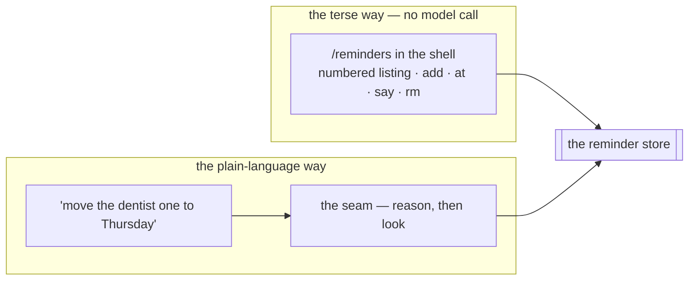
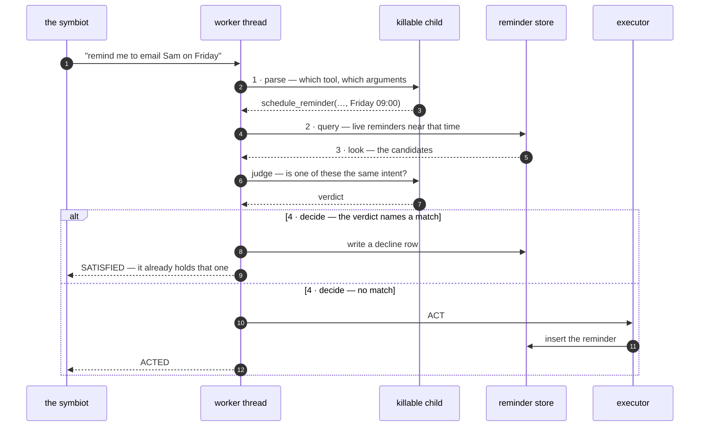

# the reminder: the tool registry's first inhabitant, and its lifecycle

The reminder is the first tool The Joy can reach for. It does the humblest useful thing an acting loop can do: hear "remind me of X at Y" in the ordinary flow of conversation, and at Y, say X back. One message, one future time, one fire. It was chosen first not because reminders are important but because they are *clean* — no external driver, no third-party credential, only a durable row in our own store and the reply path already built — so what it proves is the [tool-calling machinery](../tool-calling.md), not the plumbing of an integration.

Four tools live over that one row today: `schedule_reminder` sets one, `cancel_reminder` calls one off, `update_reminder` moves or rewords one, and `read_reminders` says what is being held over a stretch of time. Three of them exist because of one absence: for a while nothing could **read** the reminders the machine was currently holding, so the lifecycle was one-way — born from a sentence, fired, done. Everything past the scheduling section here is the fixing of that.

This document is the reminder in particular; the seam it rides — retrieve, decide, look, act, speak, and the invariant that the model decides and code does — is [`doc/tool-calling.md`](../tool-calling.md).

## what it is, as a tool

All four are `Tool`s like any other (`services/tools/reminder.py`), joined to the machinery by their names. Taking the scheduling one as the pattern:

- **name** — `schedule_reminder`, what the decision emits and the key its executor is registered under.
- **description** — the prose the catalog recall matches a message against and the decision reads to judge fit. Worded to surface on the obvious phrasings ("remind me", "don't let me forget") both by meaning and by wording.
- **argument schema** — `ReminderArgs`, three nullable fields: `reminder_message` (the line to say back, phrased the way it should be heard then), `fire_at` (the resolved moment), and `channels` (where to deliver it, or null for everywhere). Nullable so the decision can name the tool yet leave one it couldn't read null.
- **executor** — `reminder._execute`, the code that carries out the effect.
- **observe hook** — `reminder._observe`, the deduplication recall (see below).

The other three follow the same shape: `cancel_reminder` and `update_reminder` share one hook (`_target_observe`, which resolves *which* held reminder a phrase points at), and `read_reminders` declares none. Their argument fields carry distinct names — `reference`, `new_fire_at`, `new_message`, `from_time`, `until_time` — because the decision schema folds every shortlisted tool's arguments in flat, so two tools must never spell different meanings with the same field name.

## scheduling: the act

A "remind me…" message travels the ordinary [flow](../tool-calling.md#the-flow-retrieve-decide-act-speak): the catalog gate surfaces `schedule_reminder`, the decision call reads the sentence into the tool and its two arguments, and the executor runs on the worker's own thread. Two things are specific to the reminder here.

**Time is resolved in the symbiot's timezone, never the server's.** The decision call is given the symbiot's local "now" (see [timezones](../../services/loop/zone.py)) and resolves a relative cue ("in 20 minutes", "tomorrow at 9") or an absolute one ("on the 14th at noon") into a concrete instant. The executor stores that as an absolute `TIMESTAMPTZ`, so the due check later compares two absolute instants and the summer-time shift is already baked in. A `fire_at` that arrives without a zone is read as the symbiot's local wall clock.

**When the time can't be read, it asks rather than guesses.** If the decision leaves `fire_at` (or the message) null, the executor stores *nothing* and returns [`UNCLEAR`](../tool-calling.md#the-ways-an-act-can-end), so the confirmation asks the human when they want it rather than filing a reminder it is unsure of — the reactive-ambiguity law, kept at the point of action.

**A time already gone by is refused outright, not asked about.** A resolved instant at or before now returns [`UNABLE`](../tool-calling.md#the-ways-an-act-can-end), and the summary names the reading. The distinction from the paragraph above is the difference between a question that has an answer and one that doesn't: a human asked when they want it instead will name the moment they already named, the extraction will be just as faithful the second time, and the same guard will turn it away again — an exchange with no exit. `UNABLE` states the one true thing and leaves the next move to the symbiot. Naming the reading back is what keeps the other case legible: a `fire_at` handed over as a bare UTC instant gets mis-stamped hours early by the wall-clock rule, and seeing the time it landed on is how that reads as a misreading rather than a refusal. The `update_reminder` executor refuses a new time the same way, for the same reason.

**The write is exactly-once against the triggering message.** The `reminder` row carries the `intake_id` of the message that scheduled it, under a `UNIQUE` constraint. A retried message (a deadline bite, a crash) re-runs the executor harmlessly: the second write conflicts and does nothing, the reminder already stands, and only the spoken confirmation is re-derived.

The `reminder` table (migration `0017`):

| column | meaning |
| --- | --- |
| `intake_id` | the message this was scheduled from — `UNIQUE`, the exactly-once pin on scheduling; **nullable**, because a reminder typed straight in has no message behind it (migration `0023`) |
| `symbiot_id` | whose reminder it is |
| `body` | the line to say back when it fires |
| `fire_at` | the resolved absolute instant it is due |
| `fired_at` | null until delivered, stamped when it fires — the exactly-once pin on firing, and the ledger of what fired |
| `cancelled_at` | null until called off, stamped when it is — a reminder called off is recorded, not dropped (migration `0023`) |

## the standing set: reading it, and changing it

For a while the lifecycle was one-way: born from a sentence, fired, done, with nothing able to read the reminders the machine was currently holding. That absence is what everything in this section fixes, and the fix is one **recall over the standing set** with three readers — the symbiot reading it, the machine resolving *which* reminder a phrase means, and the machine checking whether it already holds what it has just been asked for.

The store layer lives in `services/tools/reminder.py` beside the firing reads, because that module is the reminder table's data layer and has been since it was written. Reading the set belongs next to the claim and the fired stamp, not in a second file: `create`, `standing`, `find`, `update`, `cancel`.

**Every write is scoped in the statement itself.** A cancel or an edit carries three conditions in its `WHERE` clause — the row is this symbiot's, it hasn't fired, it hasn't been cancelled — and the code then reads how many rows the statement touched. One means it landed; zero means one of the three was false, and that is the refusal.

What it deliberately does **not** do is read the row, decide it looks editable, and then write. The firing sweep runs every ten seconds and waits for no one: a reminder can go off in the gap between that read and that write, and an edit that had already made up its mind would then quietly rewrite one that has already fired. All three conditions in the one statement closes the gap, because the database checks and writes in the same breath. A slow hand and a flaky connection are the ordinary case here, not the exception, so the guarantee cannot rest on the two things happening close together in time.

**Edits take absolute values, never deltas** — "set it to Thursday at nine", not "push it back an hour". That is what makes a retried edit harmless without inventing a second exactly-once pin: applied twice, an absolute value lands in the same place.

## the two ways in

The surface is reachable two ways, because neither covers for the other.

**Plain language** has to exist regardless, since it is the path the machine itself travels. **The terse command** exists because when what the symbiot wants is already unambiguous, sending it through reasoning is slower, costs tokens, and leaves room to misread an instruction that had no ambiguity in it. A reminder is a small structured record, and reaching straight for one should feel like reaching straight for it.

So the terse path spends **no model call at all**, and the time on it is parsed deterministically and kernel-side (`zone.parse_future_wall_clock`, over the grammar in `zone.parse_wall_clock`): a plain wall-clock date and time, a bare time meaning today, or a relative `+45m` / `+2h` / `+3d`, and it has to still be ahead of the symbiot. Anything else is refused flatly rather than guessed at, with the wording of the refusal kept beside the grammar it describes so the two cannot drift apart — deterministic because a closed grammar is exactly what makes the model call unnecessary, and kernel-side because the browser's clock and the zone the symbiot named can disagree, and the zone is ground truth.

The four routes are flat, the shape the kernel uses everywhere else — the standing set on a `GET`, and add, cancel and update as `POST`s carrying a body. Each reply carries the full state back the way the notification preferences do, so the shell re-renders from one source; a refusal comes back as `REMINDERS_REFUSED` with a legible reason alongside the unchanged set, the pattern the `/models` routes already set.

**The shell's numbers never leave the browser.** It prints display positions, holds the real ids off the listing it printed, and sends the ids — never re-resolving a position against a fresher fetch. That closes a race the firing sweep makes real: printing a list, being pulled away, and coming back four minutes later to type `rm 3` is the ordinary way a terminal gets used, and by then position three may be a different reminder than the one that was read. Sending the id makes a stale handle harmless, and the kernel refusing anything already fired or called off makes it legible — nothing happens, the symbiot is told so, and the list reprints.

## firing: the due sweep

Firing is a background sweep — `worker.run_reminder_sweep`, the sixth background loop, started in `main.py`'s lifespan beside the worker pool and the other sweeps. **It polls on an interval:** `REMINDER_SWEEP_INTERVAL_SECONDS` (default 10 s) is the *idle* poll — the sweep drains back-to-back while reminders are due, then waits that interval when there is nothing, so a reminder fires within about ten seconds of its moment. It has its own on/off switch, `REMINDER_ENABLED` (off under test, where the reminder tests drive `_fire_one` by hand).

Each pass (`worker._fire_one`):

1. **claims** the oldest reminder that is due (`fire_at <= now()`), unfired (`fired_at IS NULL`) and uncancelled (`cancelled_at IS NULL`), under `FOR UPDATE SKIP LOCKED` so two workers never claim the same one (`reminder.claim_due`). The cancelled clause is what makes calling one off real — without it, a reminder the symbiot cancelled would still go off — and the partial index the claim rests on carries the same two conditions, so the two always move together;
2. **raises** the stored `body` as a missive, and **mirrors** it onto the conversation stream so a later reply remembers the machine said it;
3. **stamps** `fired_at` (`reminder.mark_fired`).

All three run in **one transaction**, so the send and the record commit together: a crash before the commit leaves the reminder unfired and simply due again, and a commit sends it and stamps it, so it is never delivered twice — exactly-once on the firing side, pinned in the database, not in the sweep being careful. The row is kept, not cleared: it is the ledger of what fired and when. After the transaction, the notification fans out (`notify.dispatch`) — best-effort and deliberately outside it, since the missive already stands to be read on the next inbox open regardless, so a channel that drops the nudge costs immediacy and never the reminder.

## delivery: how the human sees it

A fired reminder is a missive — the kernel reaching out on its own — so the human discovers it through the inbox, on its own terms, not as an inline reply to a message the conversation has left behind. It reaches the human through the [notification layer](../notifications.md), so first contact never depends on one transport holding up:

- **the fan-out** — one channel-agnostic payload handed to `notify.dispatch`, sent over the channels the symbiot named when they set the reminder or, when they named none, every channel the tool supports (`reminder.SUPPORTED_CHANNELS`: web push and email). The dispatcher then drops any channel they have since globally switched off, and holds the out-of-app ones back entirely when they are present in the shell, since a nudge elsewhere is pure redundancy for a record already on the screen they are watching;
- **the inbox poll** — a gentle background poll the shell runs while the tab is open, so a reminder that fires while the human is looking at the shell surfaces within a beat even with every out-of-app channel off (a dev box, a visitor, a browser that refused notifications). That same poll is what tells the dispatcher they are present.

Either way the missive is recorded durably first, so it surfaces on the next inbox open no matter what.

## deduplication: the first decision taken on what was observed

The machine will not set a second reminder for something it is already holding, and that check is the first thing it does that is contingent on what it **observed** rather than on what the symbiot **said**.

The reason is narrower than "agentic" usually gets used for. It is not open-ended — it is a bounded four-step sequence with a known shape and no need of an unbounded loop. It earns the name because "remind me to email Sam" is a perfectly good sentence in isolation, and whether it is a *duplicate* is a fact about the world, not about the words. Everything the machine did before this was either a fixed rule watching a clock or a forward pass over a sentence. This is where it starts looking before it leaps.

**It looks in a narrow place on purpose.** Live reminders only, since one that already fired is no reason to refuse a new one. Inside a window around the moment the decision just read (`REMINDER_DEDUP_WINDOW_HOURS`), since a reminder for Friday says nothing about whether next month is being doubled up on. Ranked by how near the wording sits to what was asked for (`pg_trgm` similarity, the same fuzzy lexical measure the diary recall leans on), and capped (`REMINDER_DEDUP_LIMIT`), so a busy Friday hands the judge a handful of plausible candidates rather than the whole day. **The window, the ranking and the cap are the three knobs.**

**The judgment is exact rather than generous.** "Call the dentist" and "ring the dentist" are the same errand. "Call the dentist" and "call the dentist about the referral letter" are *not* — the second is a more specific errand and deserves its own reminder. Collapsing those two is precisely the failure worth catching, which is why the judge is told to answer null whenever it is not confident, and why the smoke ([`test/qa/0014`](../../test/qa/0014_reminder_dedup_smoke.py)) drives both cases against live models and prints what it decided.

**When the judging call can't run at all, the reminder is set anyway.** That decision belongs on the record, because the alternative is worse in a way the control flow hides: leaving the failure to fail the message would mean a safeguard against missing reminders had invented a brand new way for a reminder to go missing, one that didn't exist while the path was single-pass and had no second call to fail. A duplicate is a mild annoyance the symbiot can now see and delete, since the read surface is the thing all of this stands on; a silently absent reminder is a broken promise discovered after the thing has passed. **A check must never be able to cause the harm it was added to prevent.** A check that couldn't run goes to the log rather than a lens, because it is an infrastructure hiccup and not a judgment about the symbiot's words.

**A refused duplicate leaves a trace.** Everything else the reminders do leaves a mark: scheduling writes a row, cancelling stamps it, firing stamps it, and all of it surfaces under `/observe`. Deduplication writes *nothing* — that is its entire job — so without a row of its own, the first decision the machine takes on its own judgment would be the one decision that leaves no trace, which is backwards. So a decline gets its own row (migration `0024`): the message that asked, the reminder it matched, and when. A counter on the matched reminder would have been cheaper and would have dropped the only field worth having, since the whole failure mode is two differently worded intents collapsing into one, and the wording is the evidence. It surfaces on the reminders card beside the reminders themselves — see [observability](../observability.md).

**Typing a reminder in directly skips the check**, and that follows from what the terse path is: it spends no model call, the check needs one, and when the symbiot is typing `add` they are looking at the list they just printed. Deduplication exists for the path where the machine acts on their words without them seeing what it holds.

## cancelling and editing by language

"Cancel the dentist reminder" and "move the dentist one to Thursday at nine" cannot be resolved in a single forward pass either — which row is meant is a fact about what is held, not about the sentence — so `cancel_reminder` and `update_reminder` use the **same recall** to resolve their target. The hook narrows the live set by wording (`REMINDER_TARGET_LIMIT`, no time window, since there is no proposed moment to look around), the judge names one, and the executor writes.

**No target resolved means asked about, never guessed at.** If the phrase points at nothing, or two held reminders fit it equally well, the verdict is null and the tool returns `UNCLEAR` — being asked which one is far better for the symbiot than the wrong one being changed, and a cancel is the one write here they cannot take back by saying so again.

**Edits take absolute values, never deltas.** "Set it to Thursday at nine" is a moment; "push it back an hour" is an instruction the model resolves into a moment against the reminder it can see. That is what makes a retried edit harmless without a second exactly-once pin: applied twice, an absolute value lands in the same place.

A reminder that fired or was called off in the meantime comes back `UNABLE` rather than `UNCLEAR` — received, cannot be carried out, and asking again would change nothing.

## reading it back in plain talk

"What am I holding for next week?" is a read, and `read_reminders` answers it properly: work out what *next week* means, fetch what falls inside it, and say it in a sentence or two a person can take in. Three steps.

**First the frame.** `next week`, `tomorrow`, `the rest of today`, `before I fly on the 14th` — the model's job is to turn the phrase into two wall-clock instants, a start and an end, and nothing else. The zone comes from the kernel, from the zone the symbiot said they live in, the same law the reminder's own fire time follows: read the face of the clock from their words, stamp the zone ourselves, never trust an offset the model volunteered. A phrase that won't resolve is asked about rather than guessed at.

**Then the read**, on the worker's thread, live reminders inside that window and no others. Which is the part that matters for cost: the prompt carries what was asked about instead of a ledger. The window is what keeps it small, so a wide question is a bigger read and a narrow one is nearly free — and the day this runs on a small local model, asking about tomorrow costs what tomorrow costs.

**Then the summary**, in the symbiot's own voice, in prose — the ordinary confirmation call, given the facts grouped by day, times in order, near ones before far. This is the one tool here that answers [`REPORTED`](../tool-calling.md#the-ways-an-act-can-end) rather than `ACTED`: it was asked a question, nothing was asked to change, and nothing happened, so the line it speaks is *here is the answer* rather than *here is what I did*. Not the numbered listing: that already exists, it is `/reminders`, and it is there for when the symbiot wants to *operate* on the rows. This is the other thing entirely — three things on Wednesday and one of them at seven in the morning, said the way somebody would say it. If the window is empty it says so plainly, because "nothing next week" is a real answer and silence isn't.

The read stays capped (`REMINDER_DIGEST_LIMIT`), because "what am I holding this year" is a fair question and the answer might be forty rows. When the cap bites, the machine says there are more beyond what it can see rather than summarising the first handful as though that were all of it. Incomplete and saying so is a limit; incomplete and silent would be a bug.

## configuration

| variable | default | what it does |
| --- | --- | --- |
| `TOOLS_ENABLED` | on | the startup catalog reconcile (off under test, so startup never embeds) |
| `TOOL_DECISION_MODEL` | `MID_MODEL` | the model that decides which tool and extracts the arguments |
| `TOOL_CONFIRM_MODEL` | `MID_MODEL` | the model that composes the confirmation in the symbiot's voice |
| `TOOL_RECALL_MAX_DISTANCE` | `0.6` | the gate's cosine-distance threshold — coarse, generous, since the decision is the precision |
| `TOOL_RECALL_LIMIT` | `5` | the shortlist size handed to the decision |
| `TOOL_RECALL_EF_SEARCH` | `100` | the HNSW working-set width for the catalog search |
| `TOOL_OBSERVATION_JUDGE_MODEL` | `SMALL_MODEL` | the model that rules on what an observe hook found — a bounded pick, so the cheap rung |
| `REMINDER_DEDUP_WINDOW_HOURS` | `12` | how far either side of the proposed moment the dedup recall looks |
| `REMINDER_DEDUP_LIMIT` | `5` | how many candidates the dedup recall hands the judge |
| `REMINDER_TARGET_LIMIT` | `8` | how many candidates the "which one do they mean" recall hands the judge |
| `REMINDER_DIGEST_LIMIT` | `20` | how many reminders the plain-language read will summarise at once |
| `REMINDER_ENABLED` | on | the firing sweep (off under test) |
| `REMINDER_SWEEP_INTERVAL_SECONDS` | `10` | the firing sweep's idle poll |
| `REMINDER_LISTING_LIMIT` | `50` | how many live reminders the standing-set read hands back — the listing's cap |
| `REMINDER_LISTING_SETTLED` | `10` | how many recently fired-or-cancelled ones ride along at the foot of the listing |

## what it is not

One-shot only, by design. There is no recurrence ("every Monday") and no arbitrary future action. Those are the general scheduler's remit, which will later absorb the reminder as its first concrete scheduled action and generalise the firing sweep across more than one kind of timed effect. The reminder is kept honest and small so the tool-calling machinery, not a half-built scheduler, is what it proves.
